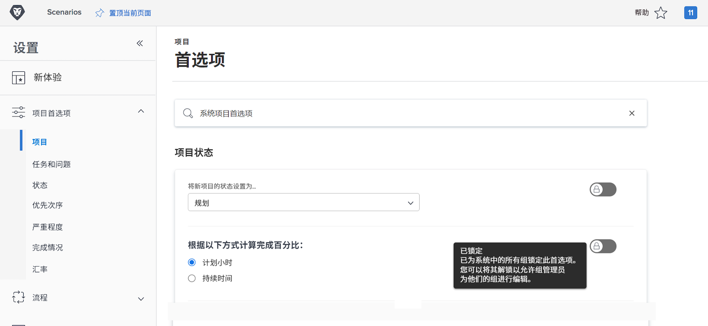
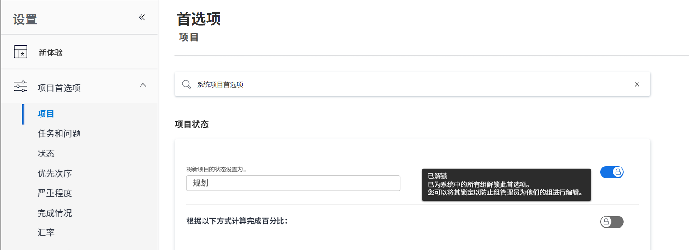

# 配置全局默认项目设置

<!---
21.4 updates have been made
--->

在此视频中，您将学习如何：

* 更改自定义状态
* 设置全局项目首选项
* 创建和使用计划

>[!VIDEO](https://video.tv.adobe.com/v/335065/?quality=12)

## 全局和组项目、任务和问题设置

当您打开 [!UICONTROL Projects] 设置 [!DNL Workfront]，您会注意到上面显示“[!UICONTROL System Project Preferences]”。 这样，您就可以知道这些设置会影响 [!DNL Workfront] 系统 — 它是一个全局配置。

![[!UICONTROL Project Preferences] 页面 [!UICONTROL Setup]](assets/admin-fund-system-project-preferences-1.png)

打开 [!UICONTROL Tasks & Issues] 设置。

![[!UICONTROL Task & Issue Preferences] in [!UICONTROL Setup]](assets/admin-fund-task-issue-preferences-2.png)

但是，可能不是每个 [!DNL Workfront] 需要相同的项目、任务和问题首选项。 例如，营销组希望新项目的状态为“计划”，而项目经理组更喜欢“请求”状态。

[!DNL Workfront] 允许组管理员调整其组的特定项目、任务和问题首选项。 可调整的偏好由 [!DNL Workfront] 系统管理员使用锁/解锁切换。

首先，导航到 [!UICONTROL Setup] 区域：

1. 选择 **[!UICONTROL Setup]** 在 **[!UICONTROL Main Menu]**.
1. 展开 **[!UICONTROL Project Preferences]** 中。
1. 选择 **[!UICONTROL Projects]** 或 **[!UICONTROL Tasks & Issues]**，具体取决于您要修改的设置。

锁定首选项以阻止组管理员为其组调整该设置。

解锁首选项，以便组管理员可以对其进行自定义。

某些设置无法解锁并保持全局系统设置。

### 设置组和子组首选项

对于系统管理员解锁的任何设置，组管理员可以对其管理的组以及这些组下嵌套的任何子组进行调整。 此外，群组管理员还可以控制其子群组管理员可以修改的设置。

1. 选择 **[!UICONTROL Setup]** 在 **[!UICONTROL Main Menu]**.
1. 单击 **[!DNL Groups]** 中。
1. 单击组或子组名称以将其打开。
1. 选择 **[!UICONTROL Project Preferences]** 或 **[!UICONTROL Tasks & Issues Preferences]** 中。
1. 对每个已解锁的首选项进行所需的更改。
1. 选择 **[!UICONTROL Save]**.

![[!UICONTROL Project Status] 部分 [!UICONTROL Group] 页面](assets/admin-fund-group-preferences.png)

如果贵组织未使用组管理员，则系统管理员可以管理不同组的首选项设置。

<!---
learn more URLs and guides
Create or edit a group status 
Group administrators 
Configure system-wide project preferences 
Configure project preferences for a group 
Configure task and issue preferences for a group 
Create and modify a group’s schedule 
--->
