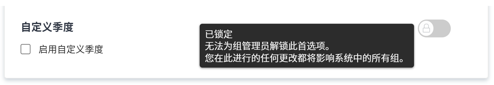

# 配置全局默认项目设置

<!---
21.4 updates have been made
--->

在本视频中，您将了解如何：

* 更改自定义状态
* 设置全局项目偏好设置
* 创建和使用计划

>[!VIDEO](https://video.tv.adobe.com/v/335065/?quality=12)

## 全局和组项目、任务和问题设置

当您打开 [!UICONTROL Projects] 中的设置 [!DNL Workfront]，您会注意到上面写着“[!UICONTROL System Project Preferences]”时，会在窗口顶部的搜索栏中找到。 通过此信息，您可以了解这些设置会影响 [!DNL Workfront] 系统 — 这是一种全局配置。

![[!UICONTROL Project Preferences] 页面位置 [!UICONTROL Setup]](assets/admin-fund-system-project-preferences-1.png)

当您打开 [!UICONTROL Tasks & Issues] 设置。

![[!UICONTROL Task & Issue Preferences] in [!UICONTROL Setup]](assets/admin-fund-task-issue-preferences-2.png)

但是，可能不是所有的 [!DNL Workfront] 需要相同的项目、任务和问题偏好设置。 例如，营销组希望新项目的状态为计划，而项目经理组更喜欢请求状态。

[!DNL Workfront] 允许组管理员调整其组的某些项目、任务和问题偏好设置。 可调整的偏好设置由 [!DNL Workfront] 系统管理员使用锁定/解锁进行切换。

首先，导航到 [!UICONTROL Setup] 区域：

1. 选择 **[!UICONTROL Setup]** 在 **[!UICONTROL Main Menu]**.
1. 展开 **[!UICONTROL Project Preferences]** （在左侧菜单中）。
1. 选择 **[!UICONTROL Projects]** 或 **[!UICONTROL Tasks & Issues]**，具体取决于您要修改的设置。

锁定首选项以防止组管理员为其组调整该设置。

解锁首选项，使其可供组管理员自定义。

某些设置无法解锁，仍保留全局系统设置。

### 设置组和子组首选项

对于系统管理员解锁的任何设置，组管理员可以对其管理的组以及嵌套在这些组下的任何子组进行调整。 此外，组管理员可以控制其子组管理员可以修改的设置。

1. 选择 **[!UICONTROL Setup]** 在 **[!UICONTROL Main Menu]**.
1. 单击 **[!DNL Groups]** （在左侧菜单中）。
1. 单击组或子组名称以将其打开。
1. 选择 **[!UICONTROL Project Preferences]** 或 **[!UICONTROL Tasks & Issues Preferences]** （在左侧菜单中）。
1. 对每个已解锁的首选项进行所需的更改。
1. 选择 **[!UICONTROL Save]**.

![[!UICONTROL Project Status] 部分 [!UICONTROL Group] 页面](assets/admin-fund-group-preferences.png)

如果您的组织不使用组管理员，则系统管理员可以管理不同组的首选项设置。

<!---
learn more URLs and guides
Create or edit a group status 
Group administrators 
Configure system-wide project preferences 
Configure project preferences for a group 
Configure task and issue preferences for a group 
Create and modify a group’s schedule 
--->
