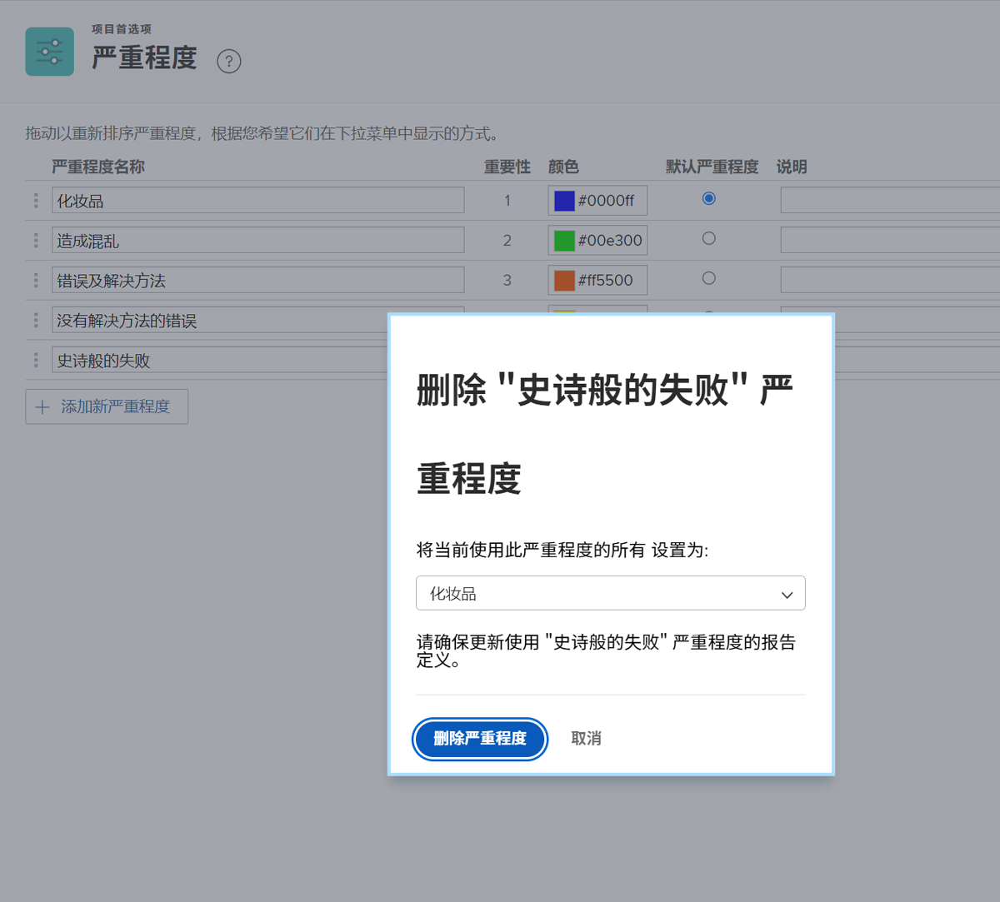

# 创建和管理问题严重性

## 问题严重性简介

严重性可用于指示问题的严重程度或可能对正在进行的工作产生的影响。

![[!UICONTROL Severity] 菜单，在 [!UICONTROL Issue Details] 窗口中](assets/admin-fund-severity-issue-details.png)

可以在 [!UICONTROL Issue Details] 中访问 [!UICONTROL Severity] 字段。它也可以包含在列表的列视图和自定义报告中。

[!DNL Workfront] 有五种默认的严重性：

* [!UICONTROL Cosmetic]
* [!UICONTROL Causes Confusion]
* [!UICONTROL Bug with workaround]
* [!UICONTROL Bug with no workaround]
* [!UICONTROL Fatal error]

如果需要，系统管理员可以重命名这些默认严重性或创建新的严重性。

严重性仅适用于 [!DNL Workfront] 中的问题。

## 创建和管理问题严重性

作为系统管理员，如果需要，您可以创建新的严重性，以完成问题的工作流。

![[!UICONTROL Severities] 页面，位于 [!UICONTROL Setup]](assets/admin-fund-severity-section.png)

1. 单击 **[!UICONTROL Main Menu]** 中的 **[!UICONTROL Setup]**。
1. 展开左侧菜单面板中的 **[!UICONTROL Project Preferences]** 部分。
1. 选择 **[!UICONTROL Severities]**。
1. 单击 **[!UICONTROL Add a New Severity]**。
1. 为严重性指定一个与其预期用途相匹配的名称。
1. **[!UICONTROL Importance]** 数字与问题的严重性相匹配。最高的数字对应于最高的严重性。[!UICONTROL Importance] 号码是唯一的。
1. 为您的优先级选择一种颜色。这会在图表报告和 [!DNL Workfront] 中的其他地方使用。
1. 将其中一个严重性选项指定为 **[!UICONTROL Default Severity]**。这会自动应用于 Workfront 中的所有新问题。
1. 包括对严重性的描述，例如如何使用。
1. 单击字段外部进行保存。

![[!UICONTROL Severities] 列表](assets/admin-fund-severity-new.png)

### 修改严重性

如果某项严重性不再与您的问题工作流相关，则可以对其进行重命名、隐藏或删除。

如果不再需要某项严重性，[!DNL Workfront] 建议您隐藏该严重性（单击设置区域中其旁边的 [!UICONTROL Hide] 框）。这会从问题的下拉菜单中删除该严重性选项，但会在历史数据中保留该严重性，以便其仍可用于报告目的。

![[!UICONTROL Hide] 列突出显示的 [!UICONTROL Severities] 页面，位于 [!UICONTROL Setup]](assets/admin-fund-severity-hide.png)

[!DNL Workfront] 建议您&#x200B;**不要**&#x200B;删除此前的问题中使用的严重性。当您删除一项严重性时，系统会要求您使用另一项严重性来替换。这可能会更改历史数据并影响报告。

<!---
learn more URLs
Create and customize issue severities
Update issue severity
--->
