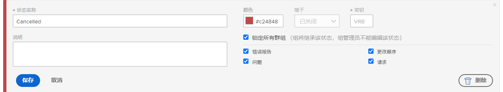
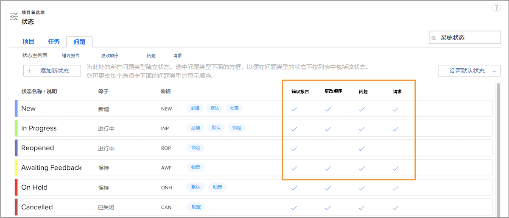

# 自定义系统范围的问题

[!DNL Workfront] 提供各种默认状态来适应您组织的问题管理工作流。可以对这些状态进行重命名，以匹配您组织的术语。并且可以将状态分配给特定的问题类型。

如果需要，可以创建其他状态。只有系统管理员才能创建系统范围的状态。此外，系统管理员可以控制组管理员可以编辑哪些状态。

![[!UICONTROL Issues] 选项卡，在 [!UICONTROL Statues] 页面上，位于 [!UICONTROL Setup]](assets/admin-fund-all-issue-statuses.png)

## 修改现有状态

[!DNL Workfront] 建议尽量减少状态数量。这使得用户可以更轻松地选择正确的状态，并减少需要维护的状态列表。

您可以编辑现有的状态，以更改名称、所分配的问题类型、相关颜色等。

![问题状态列表，其中突出显示 [!UICONTROL Edit] 选项](assets/admin-fund-edit-issue-status.png)

1. 单击 **[!UICONTROL Main Menu]** 中的 **[!UICONTROL Setup]**。
1. 展开左侧菜单面板中的 **[!UICONTROL Project Preferences]** 部分。
1. 选择 **[!UICONTROL Statuses]**。
1. 选择 **[!UICONTROL Issues]** 选项卡，并确保 [!UICONTROL System Statuses] 显示在右上角。
1. 选择 **[!UICONTROL Master List]**，以查看所有问题类型的状态。您可以在此处创建或修改问题状态。
1. 将鼠标悬停在您要重命名的状态的右侧，然后单击 **[!UICONTROL Edit]**。
1. 根据需要为状态指定新名称或更改任何其他信息。
1. 如果这些设置应适用于您 [!DNL Workfront] 实例中的所有用户，请锁定该状态。
1. 解锁该状态以允许组管理员仅编辑其组的状态。
1. 选中状态应该应用于的问题类型的框。
1. 单击 **[!UICONTROL Save]**。

### 状态分配

并非所有状态都可以分配给所有问题类型。[!UICONTROL Statuses] 页面中的各列显示了每个状态可用于哪种问题类型。

要仅查看分配给特定问题类型的状态，只需单击窗口顶部的问题类型名称。

![[!UICONTROL Issue] 选项卡，在 [!UICONTROL Status] 页面上，其中突出显示了一些列](assets/admin-fund-statuses-issue-type.png)

从这里，您可以将问题拖放到您希望它们在 [!UICONTROL Status] 下拉菜单中出现的顺序。

要编辑状态，您需要返回到 [!UICONTROL Master List]。
