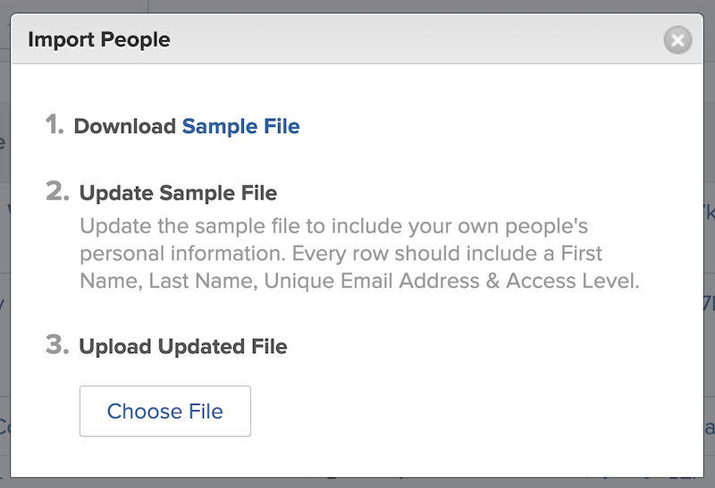
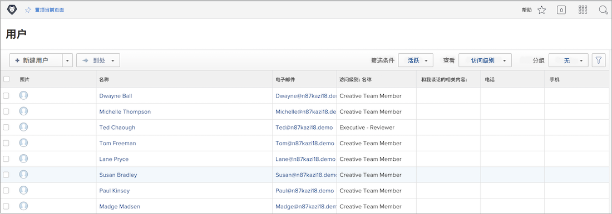

# 批量添加用户

一次添加一个用户可能会非常耗费时间和精力。 [!DNL Workfront] 允许系统管理员使用导入功能同时添加多个用户。

![[!UICONTROL Import People] 菜单选项](assets/admin-fund-adding-users-5.png)

1. 从 [!UICONTROL Main Menu] 中选择 **[!UICONTROL Users]**。
1. 选择 **[!UICONTROL New Person]** 按钮上的箭头，然后选择 **[!UICONTROL Import People]**。
1. 打开的窗口将会引导您创建要导入的用户的电子表格。
1. 下载示例文件，该文件是一个 [!DNL Excel] 电子表格。
1. 按照文件本身中的说明，使用用户信息（名字、姓氏、电子邮件地址、访问级别）更新电子表格。
1. 保存用户列表后，选择 **[!UICONTROL Choose File]** 按钮。
1. 浏览至用户电子表格文件并选择它。

导入的用户会出现在 [!UICONTROL Users] 列表中。 如果需要，编辑单个或多个用户的信息。

## 导入用户：使用启动模版

[!DNL Workfront] 提供启动模板，用于将数据导入系统。 它还可以用于导入用户。 在使用启动模板前，[!DNL Workfront] 建议您咨询您的 [!DNL Workfront] 顾问，因为您应该注意一些注意事项。

<!--
paragraph below needs URL to article
-->

有关详细信息，请参阅“通过启动模版将数据导入 Workfront”。

![[!UICONTROL Import Data] ([!UICONTROL Kick-Starts]) 窗口，在 [!UICONTROL Setup] 区域中](assets/admin-fund-adding-users-8.png)

<!--
Learn more URLs
Import users
Import data into Workfront via Kick-Starts
-->
