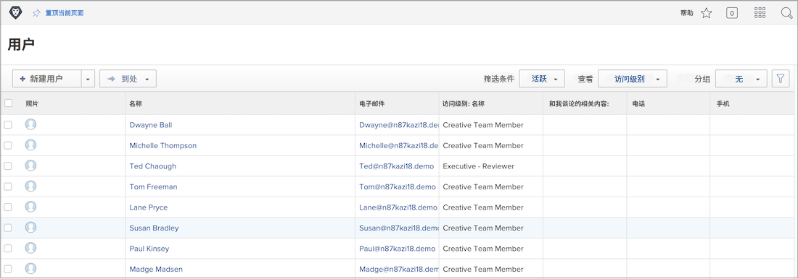

# 批量添加用户

一次添加一个用户可能非常耗时而且势不可挡。 [!DNL Workfront] 允许系统管理员使用导入功能同时添加多个用户。

![[!UICONTROL Import People] 菜单选项](assets/admin-fund-adding-users-5.png)

1. 选择 **[!UICONTROL Users]** 从 [!UICONTROL Main Menu].
1. 选择 **[!UICONTROL New Person]** 按钮，选择 **[!UICONTROL Import People]**.
1. 打开的窗口将指导您创建要导入的用户电子表格。
1. 下载样例文件，该文件是 [!DNL Excel] 电子表格。
1. 使用用户信息（名字、姓氏、电子邮件地址、访问级别）更新电子表格，按照文件本身中的说明操作。
1. 选择 **[!UICONTROL Choose File]** 按钮。
1. 导航到用户电子表格文件并将其选中。

导入的用户显示在 [!UICONTROL Users] 列表。 根据需要，编辑有关单个或多个用户的信息。

## 导入用户：使用开始

[!DNL Workfront] 提供启动模板以将数据导入系统。 它还可用于导入用户。 在你开始之前， [!DNL Workfront] 建议您使用 [!DNL Workfront] 顾问，因为您应该注意一些事项。

<!---
paragraph below needs URL to article
--->

有关详细信息，请参阅通过Kick-Start将数据导入Workfront 。

![[!UICONTROL Import Data] ([!UICONTROL Kick-Starts])窗口 [!UICONTROL Setup] 面积](assets/admin-fund-adding-users-8.png)

<!--
Learn more URLs
Import users
Import data into Workfront via Kick-Starts
-->
