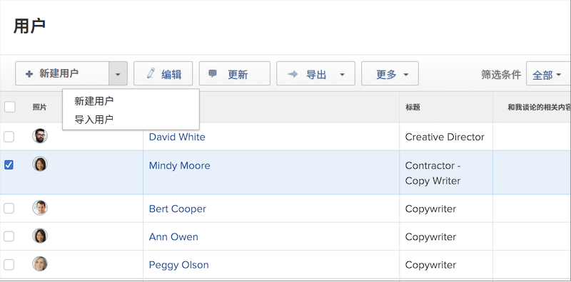

# 创建单个用户配置文件

当雇用新员工时，或者有人使用调入部门 [!DNL Workfront]，系统管理员只需创建一个用户。 这可以从 [!UICONTROL Users] 区域位于 [!DNL Workfront].

1. 选择 **[!UICONTROL Users]** 从 **[!UICONTROL Main Menu]**.
1. 单击 **[!UICONTROL New Person]** 按钮。
1. 在中输入用户的名字和姓氏 [!UICONTROL New Person] 窗口。
1. 输入用户的电子邮件地址。 这是他们的 [!DNL Workfront] 登录，并且必须在的实例中唯一 [!DNL Workfront].
1. 如果您希望用户收到有关其新登录的电子邮件，请选中发送邀请框。
1. 为人员分配访问级别。 这将授予他们的主要权限 [!DNL Workfront].
1. 将用户分配到主组，确保他们有权访问正确的工作。
1. 选择 **[!DNL Add this Person]** 以完成创建用户。

![[!UICONTROL New Person] 窗口](assets/admin-fund-adding-users-1.png)

此 [!UICONTROL Show Advanced Options] 链接会打开完整的用户详细信息窗口。 这允许系统管理员设置其他组织和资源计划信息（如团队和工作角色），以及输入有关用户的个人信息（电话号码、职称等）。

![[!UICONTROL New Person] 单击后显示的窗口 [!UICONTROL Show Advanced Options]](assets/admin-fund-adding-users-2.png)

这些信息中有些可由用户修改，有些则无法修改（取决于用户的访问级别权限）。

## 复制现有用户以创建新用户

使用系统中的现有用户作为创建新登录名的基础。 一些现有用户的信息将会复制，但其中一些信息需要从头开始填写。

1. 选择 **[!UICONTROL Users]** 从 **[!UICONTROL Main Menu]**.
1. 通过选中要复制的用户名称旁边的框来选择要复制的用户。
1. 选择上的箭头 **[!UICONTROL New Person]** 按钮并选择 **[!UICONTROL New from Selected Person]**.
1. 填写 **[!UICONTROL Personal Info]** 部分，其中包含新用户的信息。
1. 某些字段是从原始用户复制的。 根据需要更改信息。
1. 选择 **[!UICONTROL Add This Person]**.

![[!UICONTROL New Person] 窗口](assets/admin-fund-adding-users-4.png)

<!--
Learn more URLs
Add users
-->
