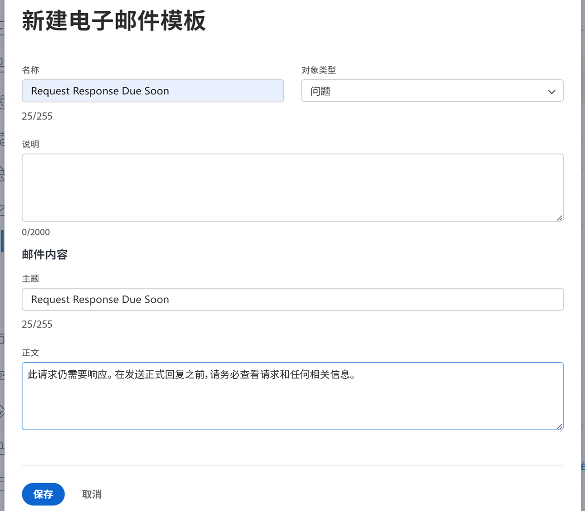

<!---
this has the same content as the system administrator notification setup and mangement section of the email and inapp notificiations learning path
--->

# 设置提醒通知

提醒通知由系统管理员在 [!UICONTROL Setup] 区域。 然后，它们可以由项目、任务和问题所有者附加和使用，作为工作即将到期或过期时的提醒。

提醒是特定于对象的，必须手动附加到相应的工作项，以便能够发送通知。

**创建提醒通知**

1. 单击 **[!UICONTROL Setup]** 在 **[!UICONTROL Main Menu]**.
1. 单击 **[!UICONTROL Email]** 部分。
1. 单击 **[!UICONTROL Notifications]** 部分。
1. 单击 **[!UICONTROL New Reminder]** 选项卡。
1. 单击 **[!UICONTROL +New Reminder Notification]** 按钮。
1. 从下拉菜单中选择所需的对象。
1. 填写所需信息。
1. 单击 **[!UICONTROL Save]**.

![[!UICONTROL New Reminder Notification] 窗口](assets/admin-fund-reminder-notification-1.png)

设置提醒时，需要考虑以下几点：

* **[!UICONTROL Reminder Notification Name]—** 这是项目经理在将提醒附加到对象时看到的名称。 确保名称简洁但具有描述性。
* **[!UICONTROL Qualifying Period]—** 在计时部分中选择的日期之前/之后的小时数、天数、周数或月数。
* **[!UICONTROL Timing]—** 选择提醒是在对象的计划、计划或实际开始/完成日期之前还是之后发送。 时间表选项与开始日期、结束日期或上次更新日期相关。
* **[!UICONTROL Criteria]—** 指定使提醒符合发送条件的条件。 选项因对象特定的提醒而异。
* **[!UICONTROL Recipients]—** 选择提醒发送对象。 利益相关者选项因为提醒选择的对象类型而异。

建立并保存提醒设置后，提醒通知便可供对象所有者在中使用 [!DNL Workfront].

## 电子邮件自定义

提醒通知使用默认电子邮件格式和消息。 如果要自定义电子邮件，可以创建模板。

<!---
paragraph above needs a hyperlink to an article
--->

<!---
learn more URLs
--->
