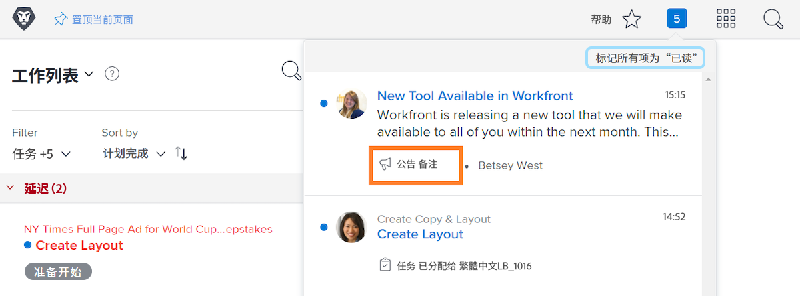
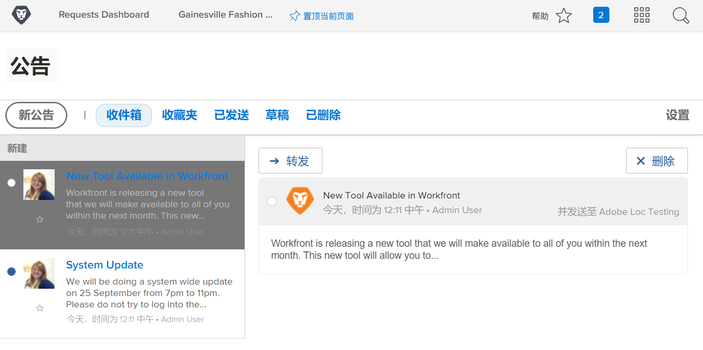

<!---
this has the same content as the system administrator notification setup and mangement section of the email and inapp notificiations learning path
--->

# 发送 [!UICONTROL Announcement Center] 消息

此 [!UICONTROL announcement center] 是系统管理员接收通信的集中位置 [!DNL Workfront] 或向贵组织的网站发送公告 [!DNL Workfront] 用户。

[!DNL Workfront] 向系统管理员发送有关软件版本、即将召开的网络研讨会、系统维护等的公告。 此 [!UICONTROL announcement center] 将所有重要信息放在一个位置，这样您就不会在电子邮件收件箱中的其他邮件中丢失这些信息。

通知图标显示任何通过发送的未读通知和公告 [!DNL Workfront]. 列表中的公告带有标签，如果您想打开它，可单击。

系统管理员还可以使用 [!UICONTROL announcement center] 发送 [!DNL Workfront]发送给用户的全域消息。 您可以发送提醒，了解联系谁寻求支持、提供“每日提示”等。

![[!UICONTROL All Announcements] 链接](assets/admin-fund-announcements-2.png)

**发送公告**

1. 单击 **通知图标**.
1. 单击 **[!UICONTROL All Announcements]**.
1. 单击 **[!UICONTROL New Announcement]** 按钮。 默认情况下， [!UICONTROL Send to] 行填充 [!UICONTROL Everyone] 向所有人发送消息 [!DNL Workfront] 用户。 您可以删除它并输入用户、工作角色、团队、组或公司的名称。
1. 输入主题行。
1. 然后根据需要使用编辑工具键入公告的文本。
1. 通过单击 **[!UICONTROL Add Attachment]** 按钮（如果适用）。
1. 单击 **[!UICONTROL Send]**.

![于2014年12月31日刊登 [!UICONTROL Announcements] 页面](assets/admin-fund-announcements-3.png)

公告区域看起来像一个收件箱，其中已接收的消息位于左侧面板。 单击消息以阅读它。

