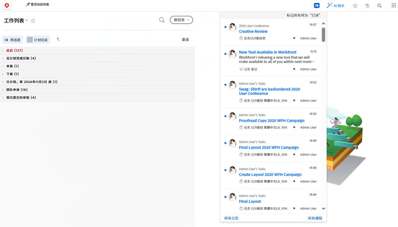
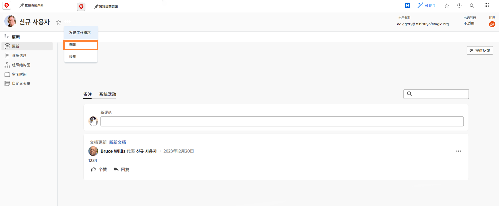

# 管理应用程序内通知和电子邮件事件通知

电子邮件是日常工作生活的一部分，有时，您收到的电子邮件数量十分惊人。但是，有了 [!DNL Workfront]，系统管理员可以确保每个人收到的是有关他们所参与的工作的相关且有用的电子邮件。

Workfront 可以向用户发送多种类型的通知。其中一些通知在系统级别进行控制并会影响所有用户。某些通知可以设置为立即生成每日摘要电子邮件。或者关闭电子邮件通知可以仅在 Workfront 内生成通知。

## 事件通知

事件是状态更改、发布评论或分配任务等类似的活动，可以在 [!DNL Workfront] 中触发应用程序内通知。

但是，您可以通过选择或取消选择首选项中的选项来确定您希望接收哪些事件的电子邮件通知。

要进行这些更改，请单击您在 [!UICONTROL Main Menu] 中的名字。

![用户名，位于 [!UICONTROL Main Menu]](assets/admin-fund-user-notifications-02.png)

单击 [!UICONTROL More] 菜单中的 [!UICONTROL Edit]。

单击 [!UICONTROL Edit Person] 弹出框中的 [!UICONTROL Notifications]。

![[!UICONTROL Edit Person] 窗口](assets/admin-fund-user-notifications-04.png)

从这里，您可以决定要立即接收、每天接收或完全不接收哪些通知。您在此处所做的任何更改都是针对您的，不会影响 Workfront 中的任何其他用户。

**[!UICONTROL Daily]**

默认设置是立即发送电子邮件。但是，您可以将电子邮件通知频率从 [!UICONTROL Instant] 切换到 [!UICONTROL Daily]，以确保您在需要时获得所需的信息。

![[!UICONTROL Notification] 部分，在 [!UICONTROL Edit Person] 窗口中](assets/admin-fund-user-notifications-05.png)

每日选项会通过一封电子邮件发送当天事件的摘要。用户在 [!UICONTROL Notifications] 部分看到的每个分组都会发送一封电子邮件。

例如，[!UICONTROL Information about Projects I Own] 部分会每日生成一封电子邮件，[!UICONTROL Action Needed] 部分会每日生成一封电子邮件等。

![[!UICONTROL Daily Digest] 电子邮件，关于 [!UICONTROL Information about Projects I Own]](assets/admin-fund-user-notifications-06.png)

![[!UICONTROL Daily Digest] 电子邮件，关于 [!UICONTROL Action Needed]](assets/admin-fund-user-notifications-07.png)

除了选择每日选项之外，还可以设置发送这些电子邮件的时间。根据最有效的方式，可以在早上上班之前或下班前发送摘要电子邮件。

![[!UICONTROL Email Daily Digest after] 下拉菜单，在 [!UICONTROL Edit Person] 窗口中](assets/admin-fund-user-notifications-08.png)

**完全不发送**

最后一个选项是完全关闭电子邮件通知。

![在 [!UICONTROL Edit Person] 窗口中所选通知已关闭](assets/admin-fund-user-notifications-09.png)

如果您决定这样做，请注意，尽管您不会收到电子邮件，但在 [!DNL Workfront] 中，工作仍会被分配、评论和更新。关闭所有通知后，您可能会错过需要注意的重要信息。

在少数情况下，[!DNL Workfront] 看到用户关闭了电子邮件通知。例如，如果您是通过 [!DNL Workfront] 移动应用程序完成的大部分工作，您可以关闭电子邮件通知，只通过该应用程序接收通知。

无论您决定接收哪些 [!UICONTROL Event Notifications]，通知对为实现组织目标所做工作的成功都至关重要。

## 建议

[!DNL Workfront] 建议对几种通知保持选中状态，无论是接收即时电子邮件还是每日摘要。

对于大多数用户：

* [!UICONTROL A predecessor of one of my tasks is completed]
* [!UICONTROL Someone includes me on a directed update]
* [!UICONTROL Someone comments on my work item]
* [!UICONTROL The due date changes on a task I'm assigned to]

特别针对项目经理：

* [!UICONTROL A project I'm on becomes active]
* [!UICONTROL A project I own gets behind]
* [!UICONTROL An issue is added to a project I own]
* [!UICONTROL Milestone task is completed on a project I own]

<!---
learn more URLs
Email notifications
guide: manage your notifications
--->
