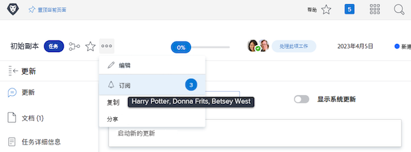

# 订阅工作项目

事件通知会向您通报分配给您的工作的最新信息。但是，有时您可能想要跟踪未分配给您的工作项目，因为这可能会影响您所做的工作。订阅特定项目是完美的解决方案。

例如，您对初始副本任务的进度感兴趣。您没有被分配到此任务，但您负责编辑该初始副本并想知道发生了什么。您可以订阅该任务，并在进行更新时收到电子邮件通知，其中提供有关工作进展情况的实时更新。

请务必注意，仅当对项目发表评论时才会发送订阅电子邮件和应用内通知。不会针对其他操作（例如截止日期修改或作业更改）发送电子邮件和通知。

为了订阅工作项目，您必须至少拥有该项目的查看共享权限。

![[!UICONTROL Task Access] 窗口](assets/admin-fund-user-notifications-11.png)

当您有权访问工作项目时，请通过以下方式订阅它：

1. 转到项目、任务或问题的登陆页面。
1. 单击 **[!UICONTROL Actions]** 菜单。
1. 单击 **[!UICONTROL Subscribe]**。

![[!UICONTROL Subscribe] 选项，在任务菜单中](assets/admin-fund-user-notifications-12.png)

您可以将鼠标悬停在菜单中 [!UICONTROL Subscribe/Unsubscribe] 旁边的数字上，查看其他有哪些用户订阅了该工作项。

如果您对工作项具有 [!UICONTROL Manage] 或者 [!UICONTROL Share] 权限，您可以通过以下方式为其他用户订阅项目、任务或问题：

1. 单击 **[!UICONTROL Subscribe]** 选项旁边的数字。
1. 添加您想要订阅工作项目的人员的姓名。
1. 单击 **[!UICONTROL Save]**。

![[!UICONTROL Subscribe] 窗口](assets/admin-fund-user-notifications-15.png)

您订阅的人不会收到有关订阅的通知。所有订阅者都被会获得“查看”该项目的权限。但是，如果订阅者已经对该项拥有 [!UICONTROL Contribute] 或 [!UICONTROL Manage] 权限，则这些权限保持不变。

单个项目的 [!UICONTROL Updates] 选项卡中的条目还指示订阅者和订阅时间。当用户被其他人订阅时，[!UICONTROL Updates] 选项卡也会进行记录。

![[!UICONTROL Updates] 页面，该页面涉及某个任务，其中显示订阅](assets/admin-fund-user-notifications-16.png)

要取消订阅用户，请再次单击气泡以打开 [!UICONTROL Subscribers] 窗口。然后单击人名旁边的 X。用户不会收到已取消订阅的通知。

![[!UICONTROL Unsubscribe] 菜单选项，涉及某个项目](assets/admin-fund-user-notifications-14.png)

<!---
learn more URL: Subscribe to items in Workfront
--->
