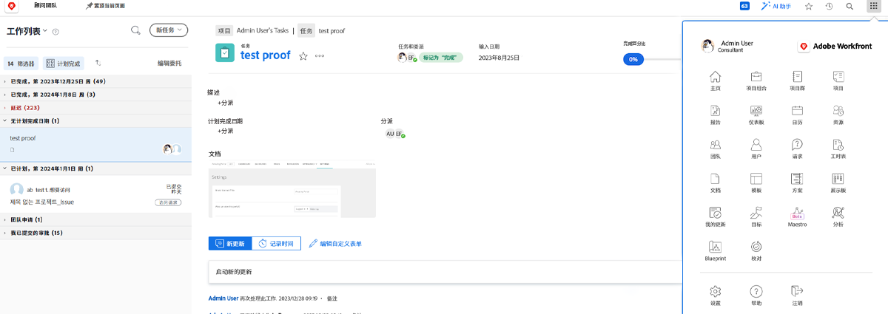
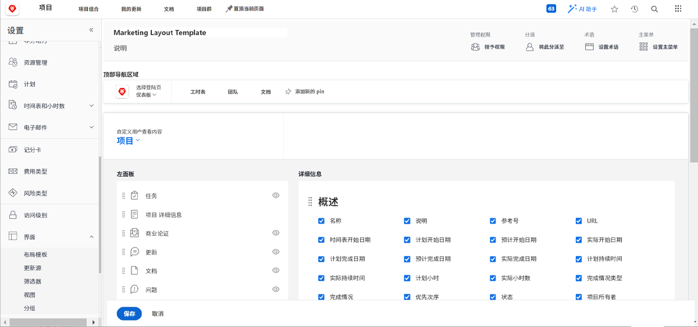
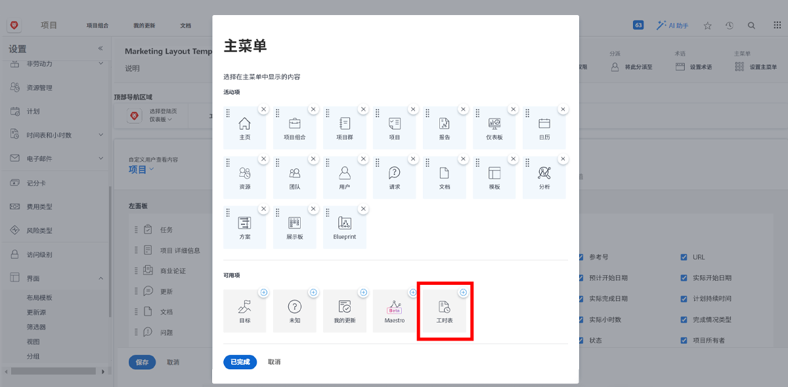
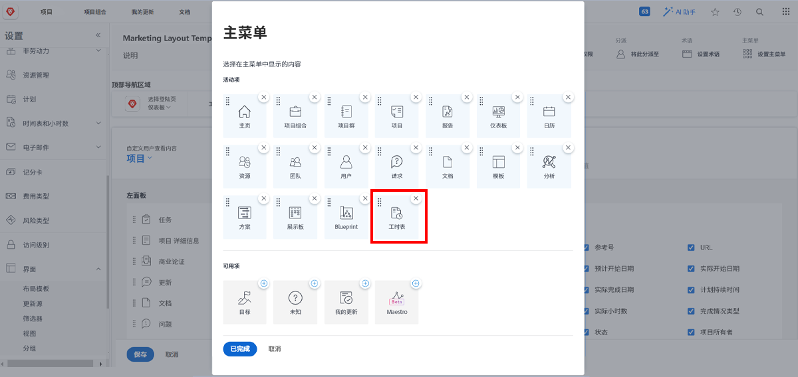

# 什么是布局模板？

Workfront有很多好工具来帮助您完成工作。 但是，过多的好事可能是压倒性的。

布局模板允许系统管理员和群组管理员自定义用户的体验，并允许这些用户专注于对他们而言重要的事情。

例如，您组织中的大多数人不记录时间。 但是，顾问团队会向客户开具账单，因此客户需要记录时间以确保准确开具账单。 使用布局模板，可以为不需要时间表的用户隐藏时间表，并为需要时间表的用户显示时间表。

## 构建之前

Workfront建议在创建布局模板之前与用户进行沟通。 如果让那些将使用布局模板的人（例如组管理员）参与进来，那么将能够更加顺畅地将正确的信息和工具放在正确的人员面前。

并且不要怕在模板创建后进行更改。 继续获取有关他们需要和希望查看和访问的内容的反馈。 请记住，布局模板旨在为用户创建简洁而轻松的体验。
