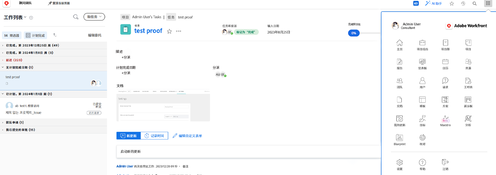
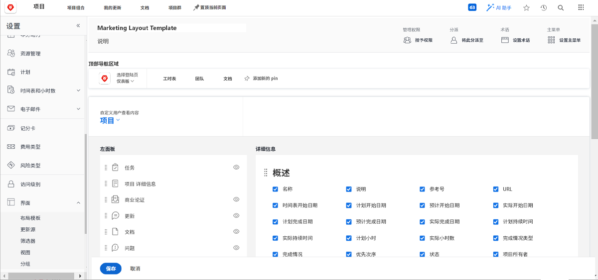
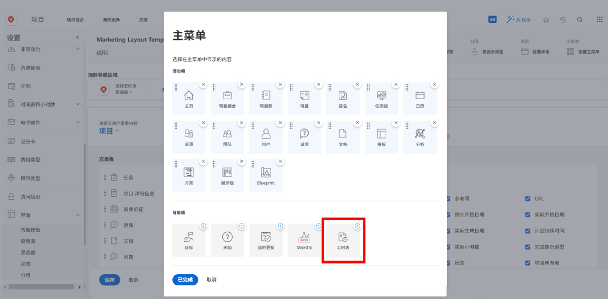
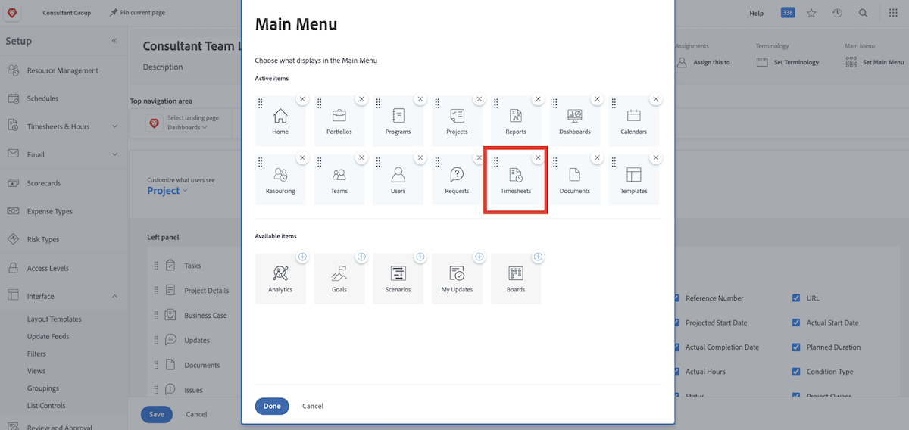

# 什么是布局模板？

Workfront 有很多好的工具可以帮助您完成工作。 但有时好用的工具太多可能会让人不知所措。

布局模板允许系统管理员和组管理员自定义用户的体验，并允许这些用户专注于对他们重要的内容。

例如，您组织中的大多数人都不记录时间。 然而，顾问团队会向客户收费，因此他们需要记录时间以确保准确计费。 有了布局模板，时间表可在不需要时隐藏，并在需要时显现。

## 在构建之前

Workfront 建议在创建布局模板之前与您的用户沟通。 让那些会使用布局模板的人（例如组管理员）参与进来，有助于更加顺利地为正确的人员提供正确的信息和工具。

创建模板后，不要害怕进行更改。 继续获得关于他们需要和想要查看和访问的内容的反馈。 请记住，布局模板旨在为您的用户创造一种干净、简单的体验。
