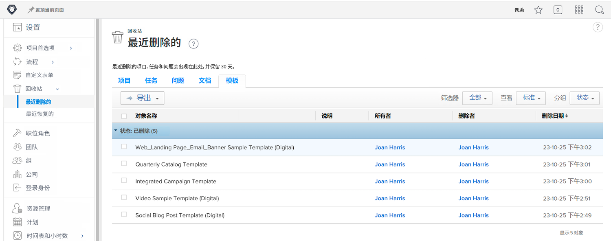
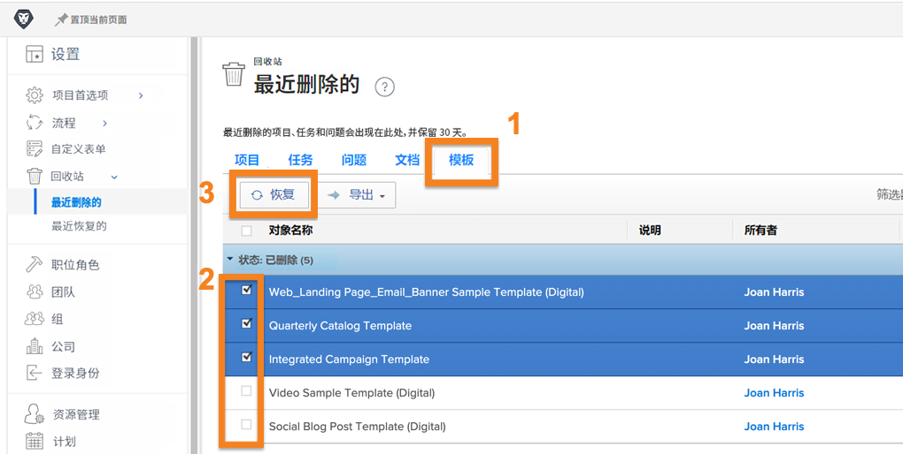
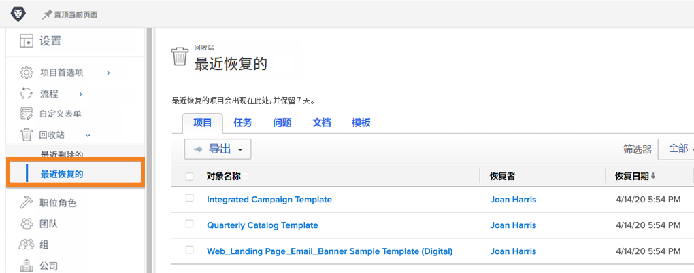

# 从回收站恢复对象

项目工作会经历许多变化。您可能删除了某些内容，但 30 分钟后才意识到还需要该任务，或者该文档对于您要解决的问题至关重要。

有了回收站，当相关对象被删除时，Workfront 会将其放置在回收站中最多 30 天。系统管理员可以将相关对象及其所有信息（更新内容、记录的时间、文档等）恢复到其在 Workfront 中的原始位置。

## 恢复对象

1. 在&#x200B;**主菜单**&#x200B;中选择&#x200B;**设置**&#x200B;区域。
1. 单击左侧面板中的&#x200B;**回收站**。
1. 选择&#x200B;**最近删除**。

每个可恢复的对象都有一个选项卡，以便更轻松地找到要恢复的特定项目。

1. 单击所需对象的选项卡。
1. 选中要恢复的对象旁边的框。
1. 单击&#x200B;**恢复**&#x200B;按钮。

正在恢复的对象会在 [!UICONTROL In Progress] 部分短暂弹出。屏幕刷新后，该对象就不会再出现在屏幕上，因为它已被恢复。这些项目会出现在 [!DNL Workfront] 中以前的位置，您可以在 [!UICONTROL Recently Restored] 屏幕上进行验证。

组管理员可以恢复与其管理的组相关联的项目以及与该项目相关联的任何任务、问题或文档。

<!---
learn more URL
Restoring deleted items
Viewing items that have been recently restored
--->
