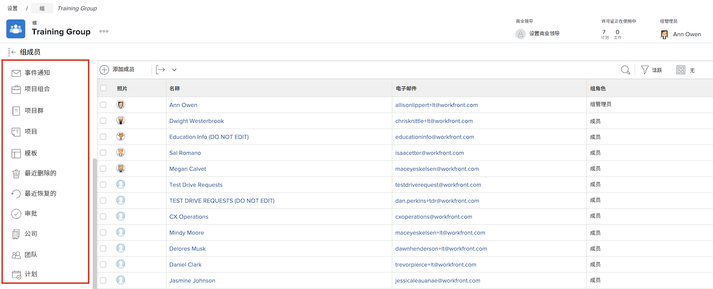

# 了解组管理员的需求

<!---
21.4 updates have been made
--->

如果您是大型公司或拥有大量 [!DNL Workfront] 用户，维护 [!DNL Workfront] 每个组和子组的设置可能非常耗时。

指定可在 [!DNL Workfront] 在更新和维护系统时，有助于平衡负载。

组管理员往往更适应其组的日常挑战，因此他们可以管理组的需求。 这样，作为系统管理员，您就可以将精力集中在 [!DNL Workfront] 使您的组织整体受益的配置。

组管理员可以在中执行的一些操作 [!DNL Workfront] 包括：

* 创建子组并将用户添加到子组。
* 为其组创建布局模板。
* 为组创建审批流程。
* 创建组级工作流状态。
* 从组页面访问与组关联的项目、项目和组合。
* 管理组级别的项目、任务和问题首选项。
* 管理组级别的时间表首选项。
* 管理组级别的事件通知。
* 以其他组成员身份登录。
* 为组分配业务负责人。
* 管理公司。

作为系统或组管理员，您可以在您管理的组和子组中创建子组。 这些子组可以分配给自己的组管理员。

>[!NOTE]
>
>一组下有14级子组的限制。

**了解有关组管理员的更多信息**

<!---
bullet points below need hyperlinks
--->

有关系统管理员、组管理员和子组管理员可以在中执行的操作列表 [!DNL Workfront]，请参阅针对不同类型管理员允许的操作一文。

## 管理群组

从 [!DNL Workfront].

1. 选择 **[!UICONTROL Setup]** 从 **[!UICONTROL Main Menu]**.
1. 转到 **[!UICONTROL Groups]** 中。
1. 选择组的名称以将其打开。
1. 在左侧面板中单击要在中进行更新的部分，以将其打开。

<!---
learn more URLs
Create and manage groups 
Create and manage subgroups 
Business leader overview 
--->
