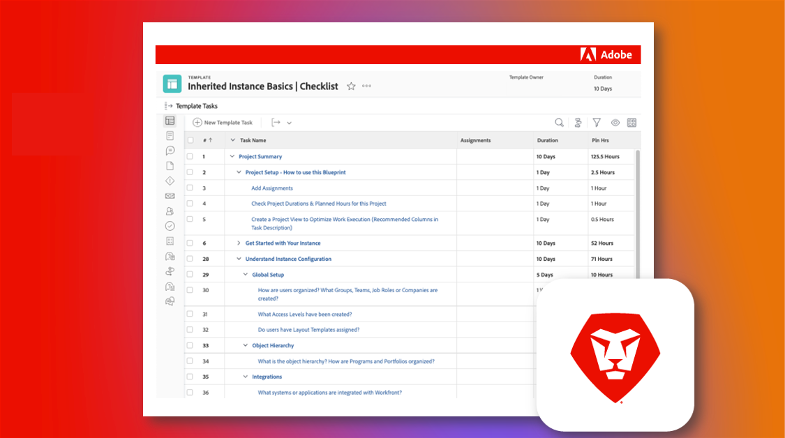

# 负责现有的 Adobe Workfront 实例

Workfront 的优点在于它的可定制性很强。Workfront 的缺点也在于它的可定制性很强。如果您是接管现有 Workfront 实例的新系统或组管理员，那么弄清楚它最初是如何配置和设置的可能会让人倍感压力。

但是，通过我们的继承的实例清单，您可以了解到您需要知道的有关您的实例的所有信息。

  

在继承的实例清单中，您会查看一组全面的问题、资源和链接，以清楚地了解其配置方式。

该清单已创建为 Workfront Blueprint 和可下载的 Excel 电子表格。我们建议使用 Blueprint 在 Workfront 中直接管理和记录您的工作。

Blueprint 和电子表格均按主题进行组织（而不是按时间线），以便您可以按照对您和您的组织最有意义的方式取得进展。所提供的持续时间只是一个示例，您应该对它们进行调整，以满足您的特定需求。这不必一次性完成！

如果有可能，我们鼓励您与组织中的其他人合作来审查和记录这些元素，并在出现任何重大更改时保持您的文档最新。您实例中未来的管理员会非常感谢您！

* <b>若要下载 Blueprint</b>，请导航到您自己的 Workfront 实例中的主菜单并选择 Blueprint。找到标题为“继承的实例基本知识|清单”的 Blueprint，然后单击“安装”。选择您的生产或沙盒环境并继续配置。有关安装和配置 Blueprint 的更多信息，请参阅[这里](https://experienceleague.adobe.com/docs/workfront/using/administration-and-setup/blueprints/blueprints-install.html?lang=zh-Hans)。

* <b>若要下载 Excel </b>清单，请单击[这里](assets/adobe-workfront-system-admin-playbook-inherited-instance.xlsx)。

无论您使用 Blueprint 还是 Excel 清单，您都可以将此过程视为 3 个关键阶段——发现、审核和文档。下面列出了相关的描述和理想的结果。

 
 

## 第一阶段：学习与发现

<b>建议时间范围：4 周</b>

首先要做的是了解您的 Workfront 实例今天是如何设置的。

这包括开展利益相关者访谈，并审查任何现有文档，以了解组织内的各个组如何利用 Workfront。

如果您从技术角度不熟悉 Workfront，请参加系统管理员培训。这提供了对 Workfront 中不同设置如何发挥作用并影响每个工具以及潜在的每个用户的必要见解。

到此阶段结束时，您应该：

* 清楚了解您的组织使用 Workfront 的原因

* 对实例运行状况具有总体的了解，其中包括关键用例

* 概述哪些方面做得好，以及流程和用户需求方面的挑战和/或差距的文档
 
 

## 第二阶段：系统审核

<b>建议时间范围：4 周</b>

进行初步发现后，建议您对实例进行更具技术性的审核。这意味着您需要确定可能需要更改或增强的方面，以确保当前的设置和配置满足您的业务要求和需求。

到此阶段结束时，您应该：

* 更深入地了解实例的当前状态

* 确定了您希望对实例进行的更改或增强，以满足业务需求。
 
 

## 第三阶段：文档记录和优化

<b>建议的时间范围：初始 = 2 周；持续更新</b>

根据您在第一阶段和第二阶段中学到的知识，您需要创建或更新您实例的文档，并制定路线图，以解决战略和项目级别的挑战。

当此阶段正在进行时，您应该：

* 编写了回答本文档中各个选项卡的问题的集中文档

* 具有最高优先级的工作流、自动化和集成的可视化图表

* 记录未来用于改善组织和战略挑战的增强功能的积压工作文件或路线图

 
通过完成每个阶段，并在继承的实例清单的帮助下，作为新的系统或组管理员，您应该能够更好地了解 Workfront 实例的配置方式、需要进行哪些调整或增强，并巩固您的文档，从而优化您组织的 Workfront 体验。

 
 

其他信息如下：
* [网络研讨会：接管继承实例的技巧](https://experienceleaguecommunities.adobe.com/t5/workfront-discussions/webinar-system-admin-essentials-tips-for-taking-over-an-existing/td-p/571873)
* [定义 Workfront 实施的目标](https://experienceleague.adobe.com/docs/workfront/using/administration-and-setup/get-started-administration/define-wf-goals-objectives.html?lang=zh-Hans)
* [博客文章：高管的赞助以及领导层获得的价值](https://experienceleaguecommunities.adobe.com/t5/workfront-blogs/customer-success-tips-executive-sponsorship-and-value-to/ba-p/518353)
* [博客文章：Adobe Workfront KPI 简介](https://experienceleaguecommunities.adobe.com/t5/workfront-blogs/kpi-dashboards-in-the-new-workfront-experience-introduction-to/ba-p/549001)
