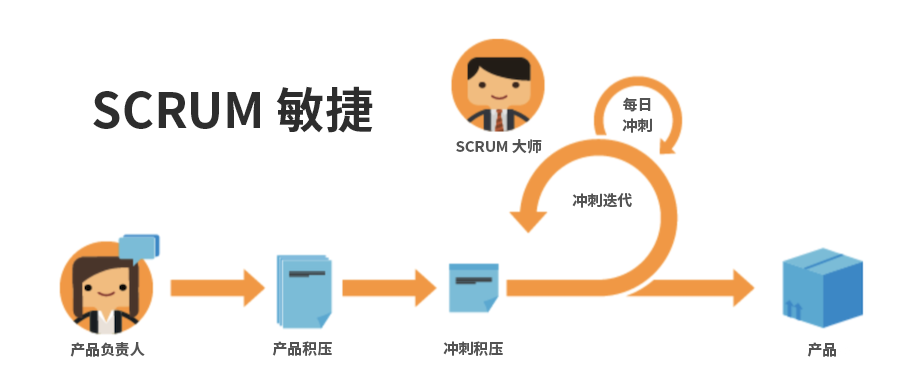

# 使用敏捷方法的益处

## 能够快速调整和转变

顾名思义，敏捷方法使团队能够更好地快速改变方向和焦点。软件和营销公司尤其意识到相关需求每周都会发生变化的趋势。敏捷方法允许团队重新评估他们正在做的工作，并以给定的增量进行调整，以确保随着工作和客户环境的变化，团队工作的重点也会随之发生变化。

## 团队工作保持透明

敏捷团队使用名为“站立会议”的每日会议来确保团队专注于需要优先开发的功能或产品。他们不会再因为不知道团队中其他人在做什么而感到困惑。他们会定期了解到团队前一天所完成的工作、他们可能遇到的需要解决的任何问题/障碍，以及他们当天计划进行的工作内容。

有了这种透明度和统一的方向，每个人都可以更快地向前推进工作。

## 经常反馈

采用敏捷方法最后的主要好处是在每次迭代结束时加入的反馈循环（请记住：迭代是团队必须努力完成特定可交付成果的一段固定时间）。反馈循环允许团队回顾过去几周的情况，以确定出现了哪些问题、今后的计划可能会如何改变、在以前的需求发生变化的情况下客户现在需要什么，以及作为一个团队吸取的经验教训。
