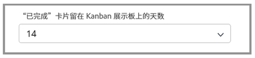

# 创建看板团队

创意营销团队使用 Scrum 一段时间了。他们欣赏敏捷团队的灵活环境，但他们发现很难承诺故事在特定的时间范围内实现，因为团队的优先级经常发生变化。

他们有 Scrum 的替代方案。这就是所谓的看板。

看板适用于那些不想在基于 Scrum 的迭代所需的时间范围内定义他们正在做什么的团队。相反，看板允许团队连续处理积压工作。

让我们将创意营销团队从 Scrum 团队切换为看板团队[1]。在“团队”设置的“敏捷”部分进行此更改。

更改方法后，您需要通过调整“WIP 限制”来指定看板团队一次可以在每列中拥有多少个故事。[2]. WIP 表示正在进行中的工作。您选择在此处放置的数字取决于团队可以处理的活动项目的数量。它将显示在团队的故事板上，以帮助提醒其是否过度分配。您（以及团队中具有编辑权限的任何成员）还可以直接从故事板更改 WIP 限制。

请注意，您可以拖放状态列，以按照您希望的顺序放置它们。

看板团队还可以选择当故事完成时，让积压工作中的下一个故事自动出现在故事板上[见上图中的数字 3]。这对于更喜欢连续工作周期的团队来说很有帮助。

下图显示了当一个故事完成后，新故事自动出现在故事板上时的样子。

为了帮助更有效地管理已完成的工作，故事默认在看板上保留 14 天。

如果需要，可以在团队设置窗口中将该设置调整为 1 到 30 天。

请记住，尽管这是一种不同的方法，但在敏捷环境中工作时，通过讨论故事需求和调整故事优先级来不断整理积压工作仍然很重要。每当您想要重新确定积压工作的优先级时，都需要将一个选项卡移至“积压工作”选项卡，以重新排列它。
