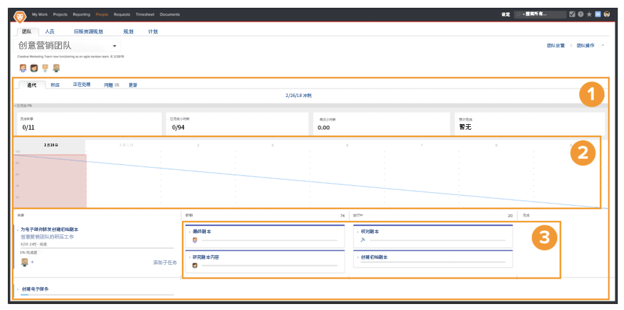

# 创建一个 Scrum 敏捷团队

## 设置一个 Scrum 团队

Workfront 的敏捷团队从迭代页面[1]完成工作。页面顶部的燃尽图[2]概述了本次迭代中迄今为止取得的进展。燃尽图下方是团队为本次迭代所承诺的故事[3]。

在该视频中，您将会了解到如何创建敏捷团队，选择 Scrum 方法，并确定 Scrum 团队的设置。

### 从头开始组建 Scrum 团队

现在您知道了 Scrum 团队设置好后会是什么样子，您可以直接开始学习如何在 Workfront 中设置它。让我们通过一个名为 Swains 的公司的案例研究来逐步了解这些设置。您负责创意团队的运营，并且您已经同意创意营销团队转向敏捷方法。

这一特定的团队决定采用 Scrum 方法，因为他们喜欢故事板能够让他们更清楚地了解谁在做什么，以及工作项目处于什么状态或阶段。能够规划较短的迭代可以很好地满足他们当前的工作需求。团队通常会进行 2-3 周的营销活动，因此他们需要能够在如此短的时间内优先考虑团队可以做什么或处理什么。

## 在 Workfront 中创建 Scrum 敏捷团队

在本视频中，您将学习如何：

- 创建敏捷团队
- 选择 Scrum 方法
- 确定 Scrum 团队的设置

>[!VIDEO](https://video.tv.adobe.com/v/346281/?quality=12&learn=on)

您已经想要将 Workfront 中的一个团队转化为敏捷团队？没问题！转到“团队”设置，并选中“这是一个敏捷团队”框。

## Scrum 团队设置更改

团队设置页面上不再包含“在问题选项卡上显示”选项，因为敏捷团队不再需要“问题”选项卡。分配给团队的问题可以在“积压工作”选项卡上找到，这使得规划包含任务和问题的工作周期变得更加容易。
