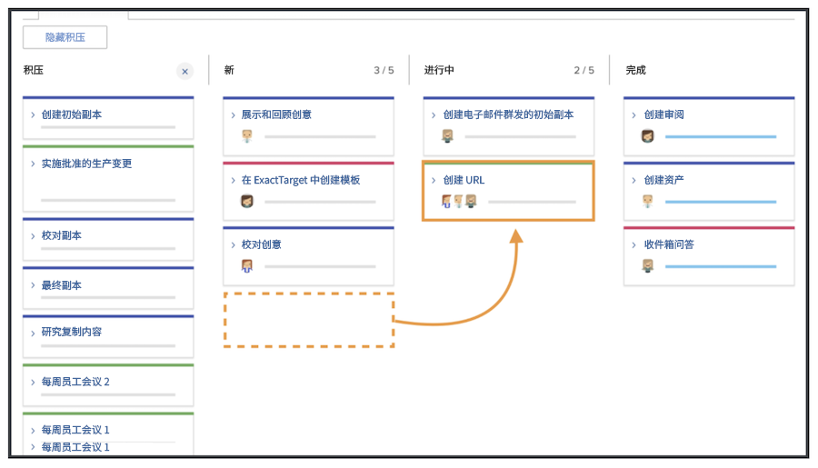
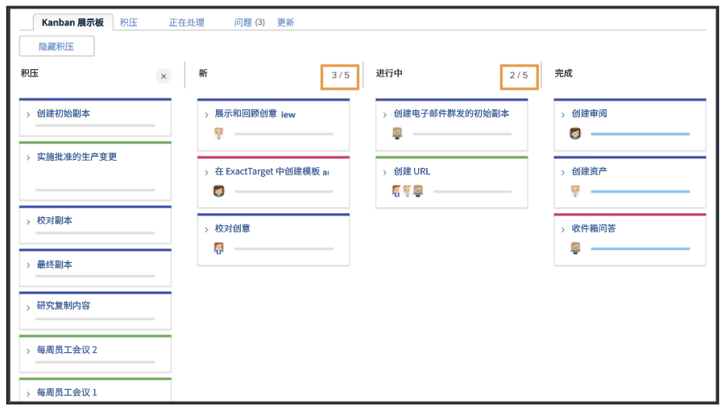
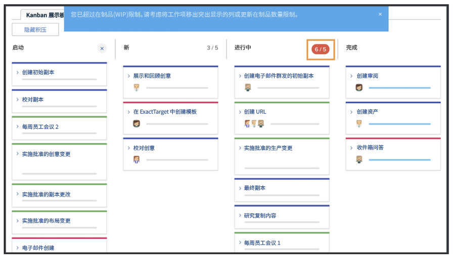

# 作为Kanban团队管理工作

管理作为看板团队的工作将故事添加到看板积压有多种方法可以将故事添加到创意营销团队的积压。

团队可以直接从积压工作中添加故事。
还可为他们分配项目中的任务。 如果创意营销团队有路由到他们的请求，这些请求将显示在团队的“请求”选项卡中。 如果团队选择请求并将其转换为故事，则这些请求将显示在团队的积压中。

## 使用Kanban板

在优先考虑积压中的故事后，是时候移至Kanban板了。 通过将将处理该故事的团队成员的头像拖放到故事卡上，您能够进行分配。

随着故事的进展，团队会将故事移动到故事板上的适当状态。 团队成员可以使用Kanban标记来指示故事是“进展顺利”、“已阻止”还是“准备提取”。 这与其他团队成员沟通，他们的工作项正在进展中，是否准备好处理。

团队成员还可以直接对序列图像板上的信息卡进行更新，以反映描述、状态或优先级等内容的更改。 为此，他们可单击故事卡上的下拉菜单，并对相应字段进行编辑 [1].

## Kanban故事执行

请注意，您使用的是五层楼的进行中工作限制。 查看讨论区，您会发现当您将任务移动到状态列时，每个通道中的任务数量都会显示在每个状态列的右上方。

如果状态列中超过等于“新建”或“进行中”的限制，您将收到一条错误消息，指示您已超过进行中工作的限制。

如果您的团队决定他们一次可以处理更多或更少项目，您（和其他拥有编辑权限的团队成员）可以通过单击WIP编号并进行编辑以反映您的新决定，从序列图像板中更改进行中工作的编号。
