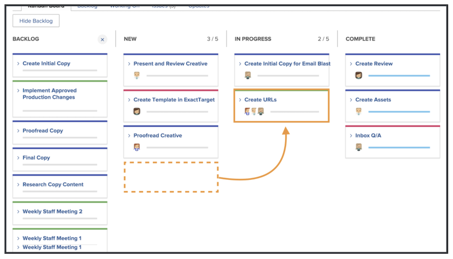
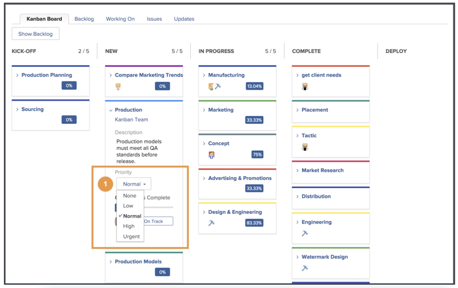
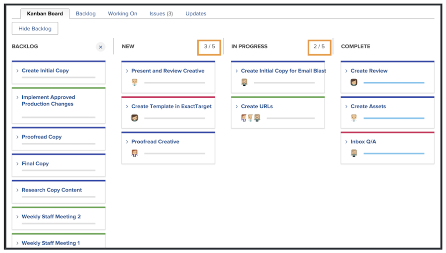
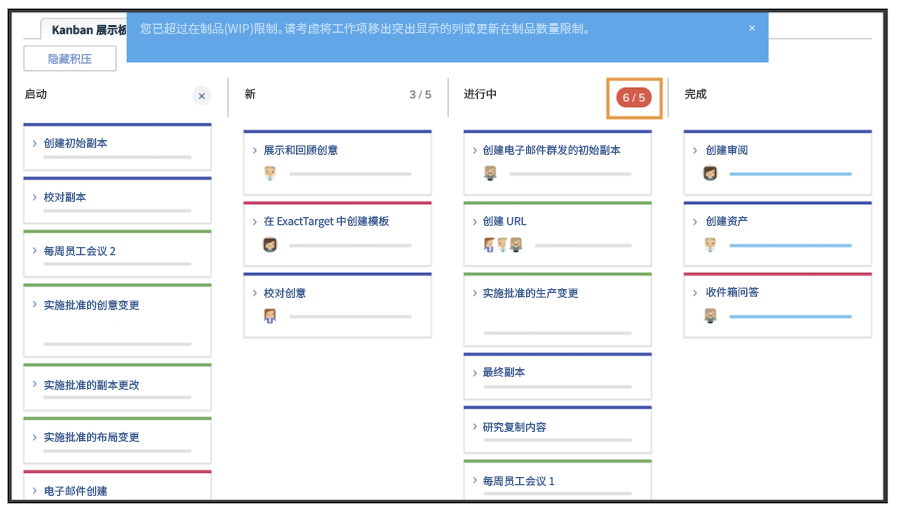

# 作为看板团队管理工作

作为看板团队管理工作
将故事添加到Kanban积压
您可以通过多种方式将故事添加到Creative营销团队的积压中。

团队可以直接从积压工作中添加故事。
它们也可以被分配到项目中的任务。 如果创意营销团队收到了发送给他们的请求，这些请求将会显示在该团队的“请求”选项卡中。 如果团队选择该请求并将其转换为故事，这些内容将会出现在团队的积压工作中。

## 使用看板

对积压工作中的故事进行优先级排序后，是时候转向看板了。 您可以通过将处理该故事的团队成员的头像拖放到故事卡上来进行分配。

随着故事的进展，团队会将其移至故事板上的相应状态。 团队成员可以使用看板标志来指示故事是一切正常、遇到阻碍还是准备就绪。 这可以向其他团队成员传达哪些工作项目正在进行中，以及它们是否已准备好接受处理。

团队成员还可以对故事板上的信息卡进行更新，以反映描述、状态或优先级等内容的变化。 他们可以通过单击故事卡上的下拉菜单并对相应字段进行编辑来完成此操作[1]。

## 看板故事执行

请注意，您使用的“正在进行的工作”限制为五个故事。 查看您的展示板时，您会发现当您将任务移至状态列时，每栏中的任务数量均会在每个状态列的右上角显示。

如果您超出状态列中相当于“新建”或“正在进行中”的限制，您将会收到一条错误消息，指示您已超出对“正在进行的工作”的限制。

如果您的团队决定一次可以处理更多或更少的项目，您（和其他具有编辑权限的团队成员）可以通过单击 WIP 数量并对其进行编辑以反映您的新决策，从而直接从故事板更改“正在进行的工作”数量。
