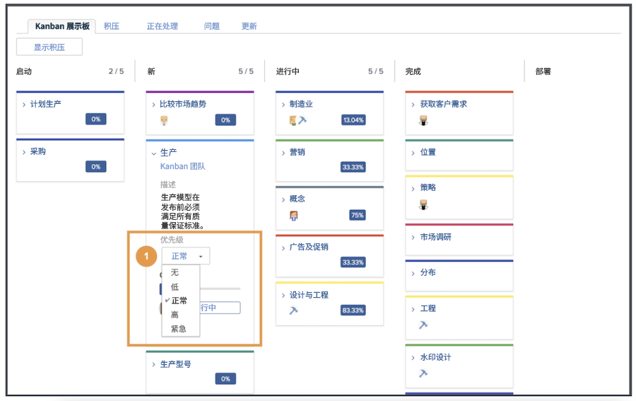

# 作为看板团队管理工作

作为看板团队管理工作将文章添加到看板积压有多种方法，可以将文章添加到创意营销团队的积压工作。

团队可以直接从积压中添加文章。
也可以在项目上为它们分配任务。 如果创意营销团队已将请求路由到这些请求，则这些请求将显示在团队的请求选项卡中。 如果团队选择请求并将其转换为文章，则这些请求将显示在团队的积压工作中。

## 使用看板板

在排定积压工作中的文章优先级后，应该转到看板板。 您可以通过将正在处理该故事的团队成员的头像拖放到故事卡片上来进行分配。

在文章上取得进展后，团队会将它们移至情节提要上的相应状态。 团队成员可以使用看板标记来指示文章是否处于“跟踪”、“阻止”或“准备拉取”状态。 这会向其他团队成员传达哪些工作项正在跟踪以及是否已准备好处理这些项目。

团队成员还可以直接对序列图像板上的信息卡进行更新，以反映描述、状态或优先级等内容的更改。 他们通过单击文章卡片上的下拉菜单并对相应字段进行编辑来执行此操作 [1].

## 看板文章执行

请注意，您使用的“在制品”限制为5篇。 查看展示板，您会看到，当将任务移入状态列时，每个通道中的任务数显示在每个状态列的右上角。

如果超出状态列中等于“新建”或“正在进行”的限制，您将收到一条错误消息，指示您已超过正在进行的工作限制。

如果您的团队决定他们一次可以处理更多或更少的项目，您（和其他具有编辑权限的团队成员）可以通过单击WIP编号并对其进行编辑来反映您的新决策，从序列图板中直接更改进行中的编号。
