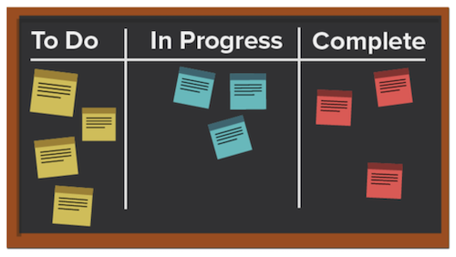

# 什么是看板方法以及它如何运作？

与其他专注于循环流程的敏捷方法不同，看板方法专注于优化的工作流。看板旨在通过使用看板展示板可视化工作，设置可处在正在进行中的工作量限制，并分析流程以进行持续改进，从而改进工作流。

让我们看一下看板的一些关键要素。

## 关键成员

看板团队中的关键成员与 Scrum 团队中的关键成员类似，只是没有 Scrum Master。对于某些人来说，担任项目经理或主管可能仍然是有意义的，但理论上，这个角色应该在需要时自然出现。

## 可视化：看板展示板

格式化看板的方法有很多种。团队在可以有任意数量列的展示板上进行操作。每一列都代表正在完成的工作的状态。

在最简单的展示板上，第一列可能是“待办事项”，第二列是“正在进行中”，第三列是“已完成”。

许多公司对列名称都有自己的术语，甚至还可能会列出流程中的每个步骤，但其意图是相同的。团队成员根据工作的状态将他们的故事从一列移动到另一列。

## 优先级

团队成员与产品经理或项目经理合作，确保积压工作和其他状态列中的故事具有优先级，并且工作继续朝着完成的方向发展。产品经理仍然负责确保客户的声音能够被听到，并且产品朝着正确的方向发展。

## 限制正在进行的工作数量

看板的一个独特之处在于，团队在任何给定时间内能够处理的故事数量是有限的。团队会为他们愿意加入“待办事项”和“正在进行”列中的故事选择一个特定的数量，并且为了防止出现疲倦，他们的故事不会超过该数量。当一个故事移至“完成”状态时，积压工作列表中的一个故事就会出现在“待办事项”列中。

## 持续改进

看板通过为团队提供衡量其有效性的系统来实现持续改进。他们可以清楚地看到工作流如何运作、工作流的每个部分需要多长时间，以及按时交付成果的频率。这使得尝试不同的方法来优化输出变得更加容易。
