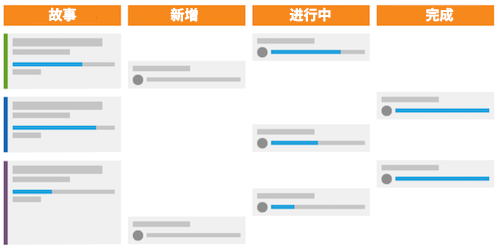
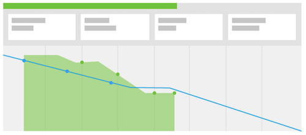

# 什么是 Scrum 方法以及它如何运作？

Scrum 方法包含灵活性模型，但它与其他方法的不同之处在于它为团队成员定义了角色，例如产品负责人、Scum Master 等，并通过定义实践来定义和完成工作。

## Scrum 团队概述

当您决定是否转用 Scrum 时，您需要查看团队的结构，看看他们是否可以轻松地转移到新方法。Scrum 团队由三类成员组成：产品负责人、Scrum Master 和团队成员。

### 产品负责人

产品负责人对产品负责，并对产品是什么或将是什么有相应的愿景。他们是客户的代言人，也是制定业务决策和产品功能优先级的主要驱动力。

### Scrum Master

Scrum Master 通过寻找所需的资源并在团队之间达成共识来帮助团队完成工作，从而尽可能高效地完成任务。他们还会促进整个过程中的沟通和共识。

### 团队成员

团队通常是跨职能的，其成员具有许多不同的工作角色和技能。他们负责规划、执行和交付产品增量。无论是全天相互协作还是在日常的团队站立会议中，他们将会受益于位于同一物理地点，或能够访问有助于快速、轻松协作的工具。

## 作为 Scrum 团队工作

在集合了这些关键参与者后，他们将会遵循一种新的工作流来完成工作并向客户交付产品。此外，与传统或瀑布法相比，他们将不再需要遵循制定最终产品计划、然后执行交付该产品所需的步骤或阶段的线性过程。相反，Scrum 团队首先会建立起积压工作。

### 建立积压工作

Scrum 团队查看优先特性以及所需功能（称为故事）的列表。他们需要询问客户，并作为一个团队讨论他们想要/需要从他们要构建的系统或产品中得到什么。

在他们创建主要故事后，则需要梳理其积压工作。作为一个团队，他们需要完成四个主要步骤。

* 通过讨论每个故事需要做什么，将大故事分解为更小的增量。

* 对他们的故事进行优先排序，并决定应首先开发哪些功能。

* 阐明故事可以被视为完成的要求和验收标准。

* 估算团队完成每个故事以及积压工作所需花费的精力。这可以按小时来估算，也可以按点数来估算。点数有助于您分辨故事的难度或复杂程度，而不是计划故事每个组成部分所需的时间。

### 迭代规划

在整理积压工作并确定优先级后，就可以规划迭代了。（许多组织互换使用“冲刺”和“迭代”这两个词。）团队根据被认为是准备就绪的故事来决定要完成哪些故事。团队分配任务，并决定开发周期的持续时间。

### 执行迭代

现在是执行迭代的时候了。团队成员开始像传统团队一样工作，但他们现在会加入一个快速的每日会议，称为站立会议。

团队成员会站立着参加这次简短的会议，并回答三个问题：

* 昨天我完成了什么？
* 今天我要完成什么？
* 阻碍他们完成任务的障碍是什么？

这些会议可以让每个人都达成共识并快速向前推进。

## 使用燃尽图和故事板来跟踪进度

当团队在站立会议中回答这三个主要问题时，监测和跟踪迭代的完成进度非常重要。这样做可以让他们确定其完成故事的速度是否足够快，以便在迭代结束时按时交付所有功能。Scrum 流程中有两个部分可以用于完成此任务。

### 故事板

通过使用故事板，团队可以在状态列中移动他们的故事，以显示工作项目何时为“新建”、“正在进行中”或“完成”。

### 燃尽图

燃尽图可用于监测团队是否以足够快的速度完成故事。燃尽图可用于单个迭代或整个产品发布。

