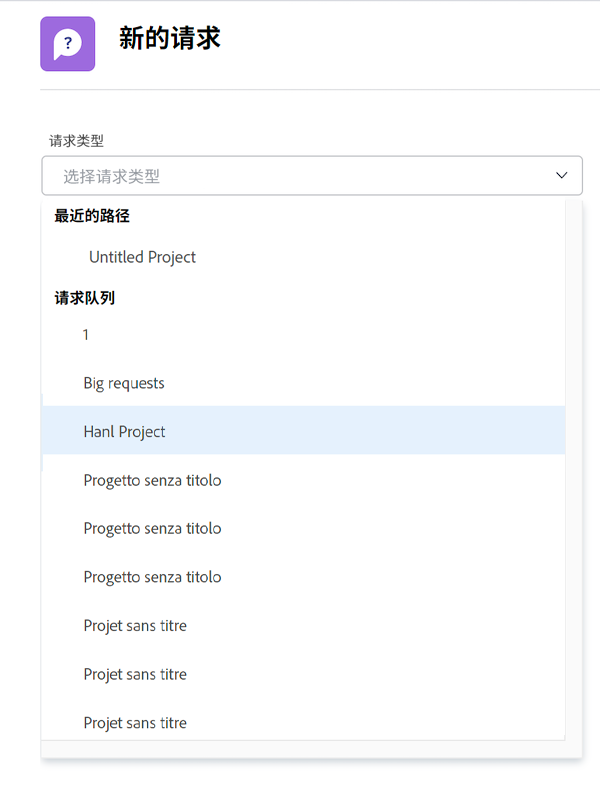
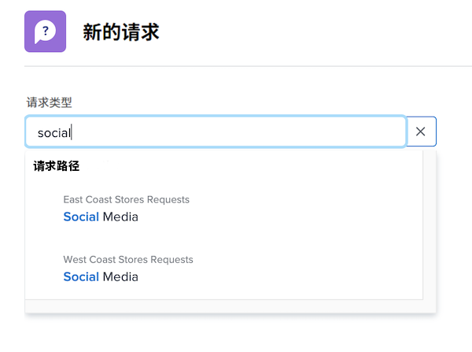

# 请求

在此视频中，您将学习如何：

* 导航到请求区域
* 请求
* 查看提交的请求
* 查找请求草稿

>[!VIDEO](https://video.tv.adobe.com/v/336092/?quality=12)

## 快速轻松地访问请求队列路径

当您单击 [!UICONTROL Request Type] 字段中，您最近提交以自动显示在列表顶部的最近三个请求路径。 选择一个选项，以向该同一队列提交另一个请求。

列表底部显示您有权访问的所有请求队列。 如果您不确定要将哪个队列用于请求，请使用关键字搜索快速轻松地找到所需队列。

在键入关键词时， [!DNL Workfront] 可显示匹配项，以便您能够找到适合自己需求的请求队列路径。 例如，要请求发布社交媒体帖子，请在 [!UICONTROL Request Type] 字段和列表会动态更新以显示任何匹配项。

选择所需的选项，填写请求表单并提交请求。

<!---
Learn more
Requests area overview
Create and submit Workfront requests
Guides
Make a work request
--->
