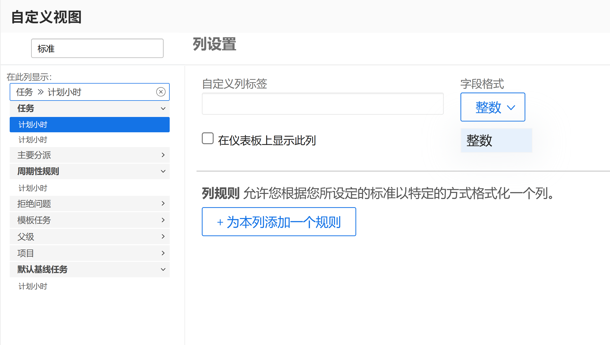
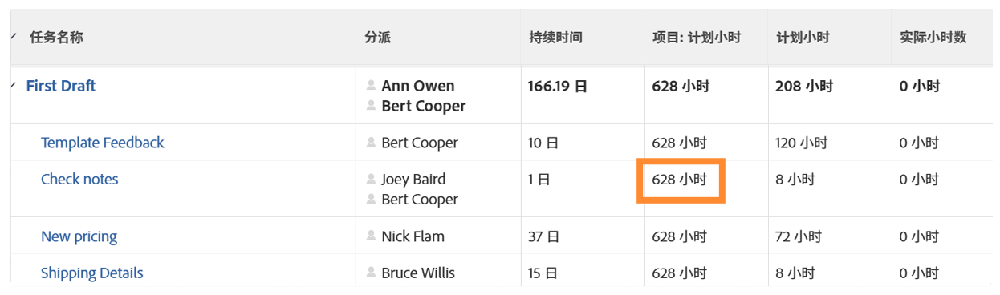

# 创建SUB、SUM、DIV或PROD数据表达式

在此视频中，您将学习：

* SUB、SUM、DIV和PROD表达式的作用
* 如何在计算字段中创建SUB数据表达式

>[!VIDEO](https://video.tv.adobe.com/v/335177/?quality=12)

## 其他信息：ROUND表达式

### 创建ROUND表达式

ROUND表达式会采用任意数字，并将其四舍五入为一定数量的小数位。

大多数情况下，当格式字段保留为“文本”或“数字”时，ROUND数据表达式将与其他数据表达式结合使用。

让我们创建一个计算字段，以确定在任务上计划的小时数与实际登录的小时数之差，该小时数需要SUB表达式，如下所示：

**SUB（计划小时数、实际小时数）**

由于时间以分钟为单位进行跟踪，并且首选格式是以小时为单位显示信息，因此表达式还需要除以60，如下所示：

**DIV（SUB（计划时数，实际时数），60）**

如果在自定义表单中构建计算字段时格式更改为“数字”，则在视图中添加该字段时，可以更改数字格式。

但是，如果创建自定义字段时的字段格式保留为“文本”，则无法在视图中轻松更改该格式。 必须使用ROUND表达式来避免在项目中看到类似于此的数字：

在计算字段中使用ROUND数据表达式ROUND表达式包括表达式的名称(ROUND)，通常包括两个数据点。 这些数据点可以是 [!DNL Workfront]，后跟一个数字，以指示您希望小数位数。

表达式的结构如下所示：ROUND（数据点， #）

在计算计划小时数与实际小时数之差的表达式中，使用此表达式DIV（SUB（计划小时数，实际小时数），60）作为第一个数据点。 然后，确保从该表达式得到的任何数字在小数点右侧不超过2位。

表达式可以写成如下：ROUND(DIV（SUB（计划时数，实际时数），60）,2)。
