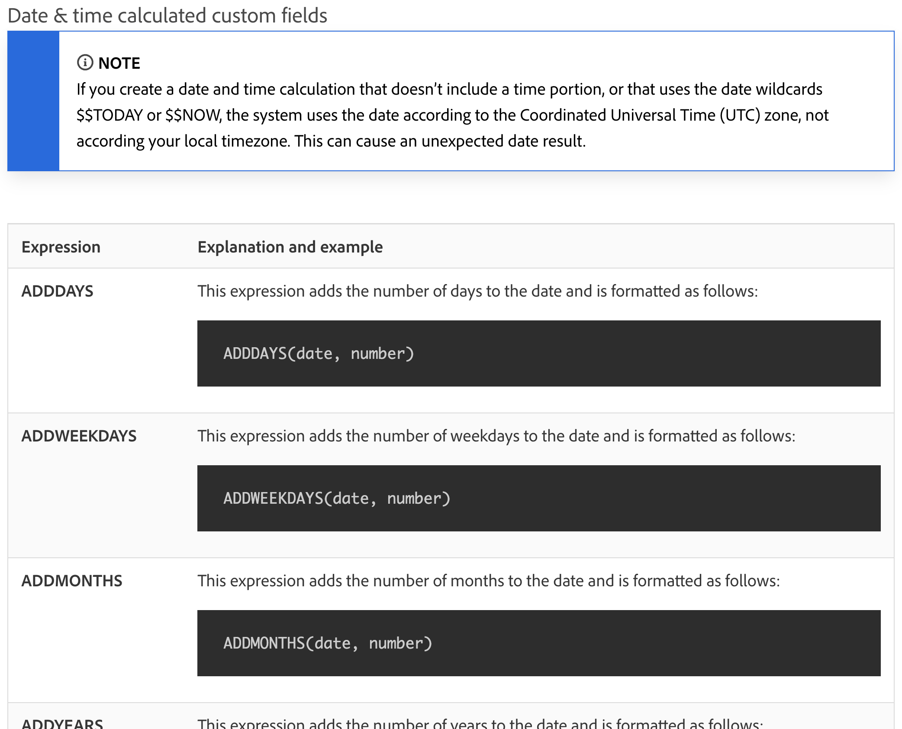

# 了解日期时间和数学表达式

## 日期及时间表达式

通过使用日期及时间表达式，您可以将重要日期提取到报告的最前面，自动计算完成任务所需的工作日数，或者在不需要时从视图中删除时间戳。

查看可用的日期和时间表达式时，您会发现有多个可用选项。

[!DNL Workfront] 客户最常使用的日期和时间表达式集有两种：

* ADDDAYS/ADDWEEKDAY/ADDMONTHS/ADDYEARS 和
* DATEDIFF / WEEKDAYDIFF

## 数学表达式

数学表达式允许 [!DNL Workfront] 自动进行计算，无论是简单还是复杂均是如此。

查看可用的日期和时间表达式时，您会发现有多个可用选项。

Workfront 客户通常会使用这两个数学表达式集：

* SUB、SUM、DIV、PROD
* ROUND

>[!NOTE]
>
>有关表达式的完整列表以及每个表达式的详细信息，请转到[计算数据表达式](https://experienceleague.adobe.com/en/docs/workfront/using/reporting/reports/calculated-custom-data/calculated-data-expressions)文档页面。

