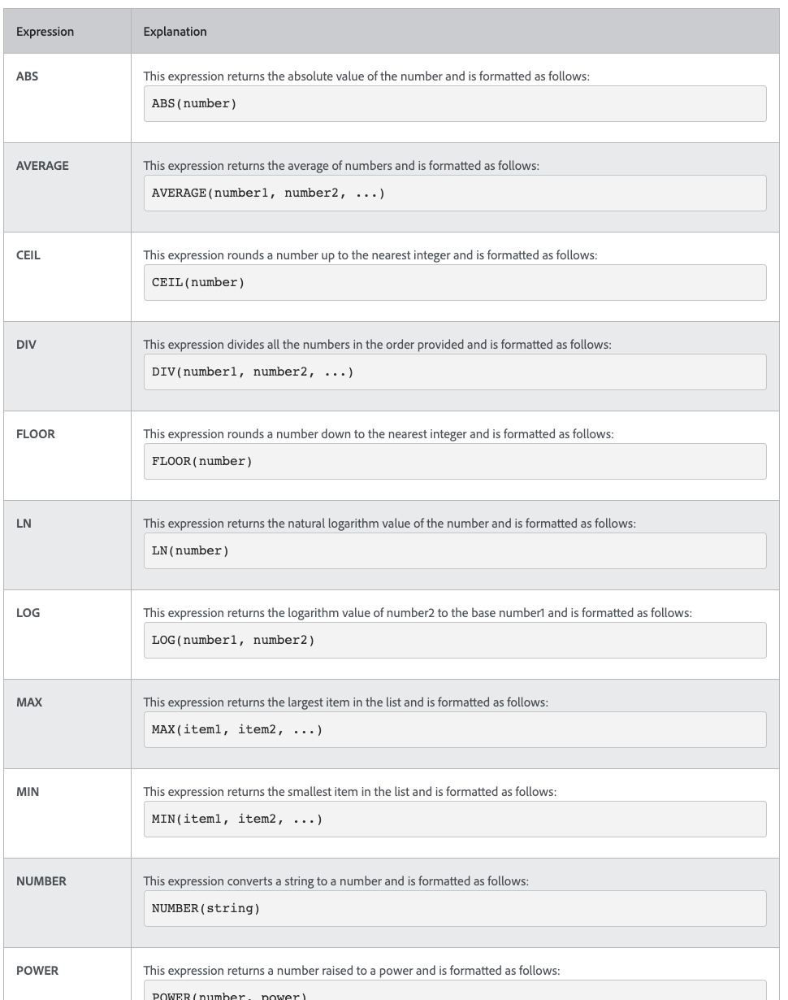

# 了解日期和时间以及数学表达式

## 日期和时间表达式

日期和时间表达式允许您将重要日期提取到报表的最前沿，自动计算完成任务所花费的工作天数，或在不需要时间戳时从视图中删除时间戳。

查看可用的日期和时间表达式时，您会找到多个可用选项。

有两个最常用的日期和时间表达式集 [!DNL Workfront] 客户：

* ADDDAYS/ADDWEEKDAY/ADDMONTHS/ADDYEARS和
* DATEDIFF / WEEKDAYDIFF

## 数学表达式

数学表达式允许 [!DNL Workfront] 自动进行计算（无论是简单的还是复杂的）。

查看可用的日期和时间表达式时，您会发现有多个可用选项。

[!DNL Workfront] 客户通常使用以下两个数学表达式集：

* SUB、SUM、DIV、PROD
* ROUND
