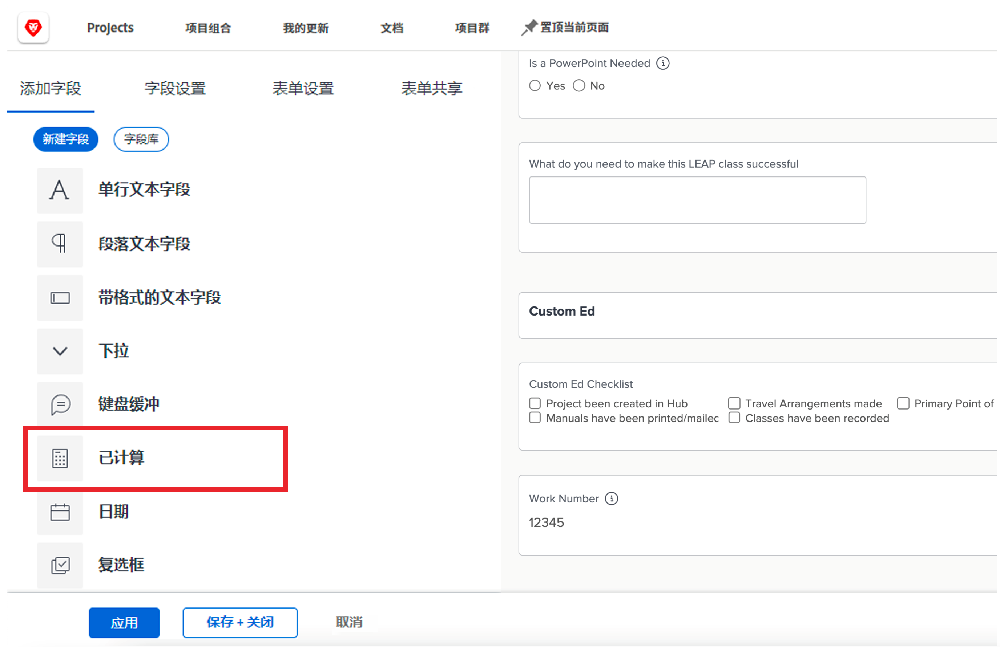
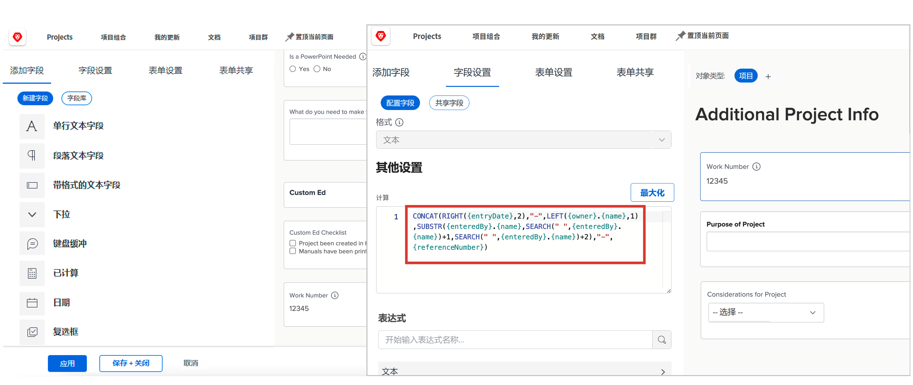
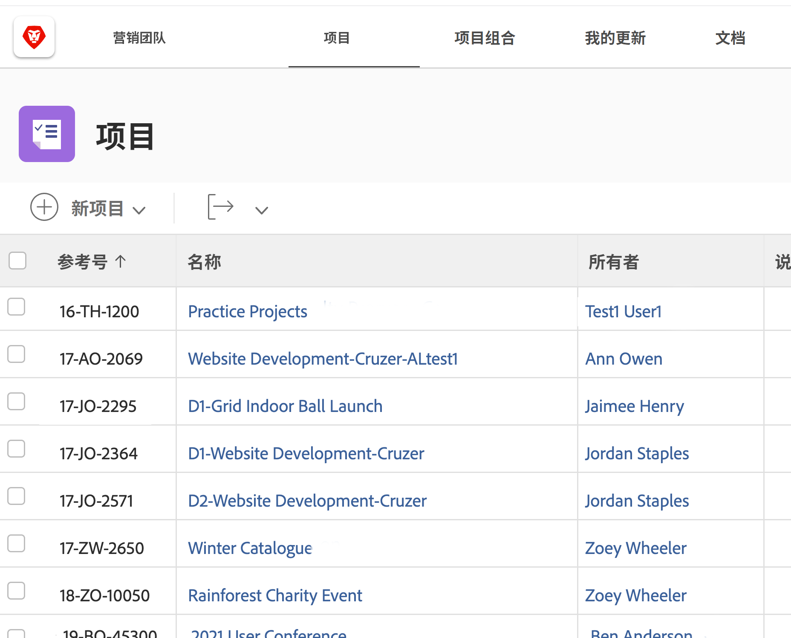

# 计算字段和表达式入门

<!-- **Note**: The expression examples shown are simple and some may be mitigated by fields already supplied by  . However, the examples are used to illustrate the foundational knowledge needed in order to build expressions in Workfront.-->

Workfront提供了多个业务领域通用的各种字段，这些字段经常用于工作管理。 计划完成日期、项目预算、任务被分派人姓名等字段。

但是，每个组织都有特定于其行业和公司的数据，需要收集这些数据以了解是否实现了公司的目标。 例如，您的组织希望跟踪：

* 项目将参与的业务线。
* 资金来自供应商、内部或两者。
* 使用的图像需要什么分辨率。

虽然这些字段并非内置于 [!DNL Workfront]，您可以创建自定义数据输入字段，并通过自定义表单预填充多选答案字段。

此学习路径侧重于计算字段。 您将了解什么是计算字段、可以通过数据表达式提取到计算字段中的不同类型信息，以及如何构建这些计算字段以增强数据收集和报告。

## 什么是计算字段？

计算字段存储使用数据表达式和现有Workfront字段创建的自定义数据。

例如，您的组织具有特定的项目编号或工作编号，系统包括：

* 创建项目的年份，
* 项目所有者的名字缩写，以及
* 此 [!DNL Workfront] 项目参考号。

在计算字段中使用表达式，您可以获取已存储在中的每条信息 [!DNL Workfront] 并创建该唯一项目ID或工作编号，然后可以将其添加到如下报表中：

根据所需的特定数据，计算字段可以很简单，使用一个或两个表达式，或者更复杂，使用多个嵌入表达式。 请记住，Workfront只能将已存储或拉入系统中的数据用于计算字段。

## 文本表达式

文本表达式搜索、剖析和组合在中找到的信息 [!DNL Workfront] 创建更有意义的数据或获得对贵组织所做工作的更深入的了解。

例如，文本表达式可用于：

* 在项目视图的列中，当项目费用超过$5,000时显示“超过$5,000”，当费用低于$5,000时显示“低于$5,000”。

* 为每个项目指定一个唯一的数字，其中包括创建项目的年份、项目的  [!DNL Workfront] 参考号、项目名称和项目所有者的首字母。

* 构建一份报告，其中列出未分配给项目组合和/或项目的每个项目，以便您可以在经理会议中使用此报告。

文本表达式可在自定义字段中使用，以便在Workfront中进行这些类型的搜索和组合。

查看可能的文本表达式时，您会找到多个选项。

有六种文本表达式最常用：

* CONCAT
* 左/右
* CONTAINS
* IF
* ISBLANK