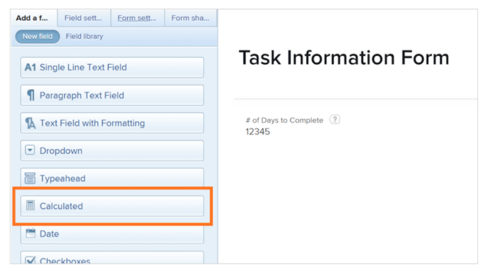
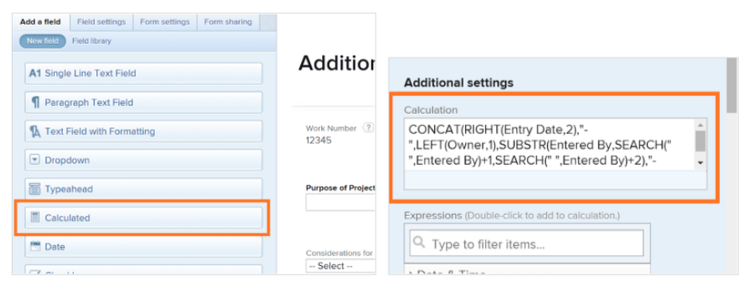
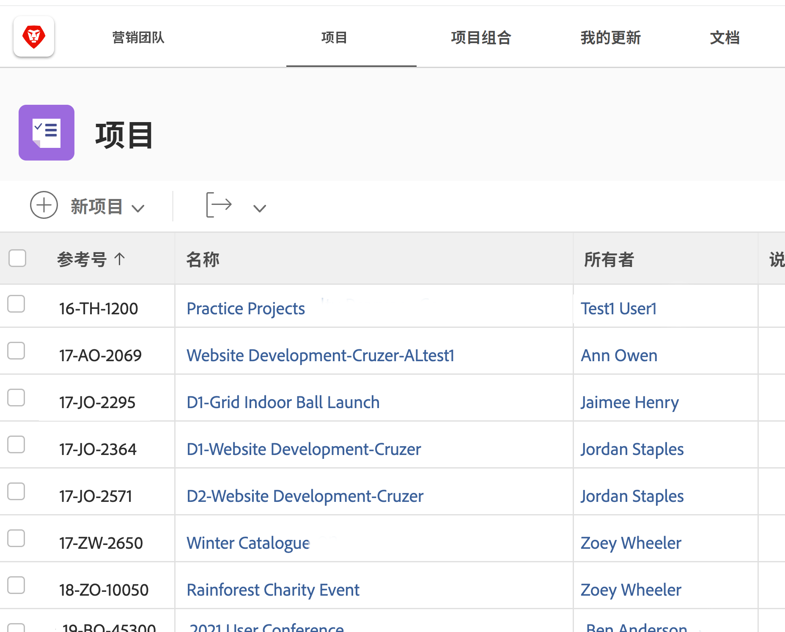
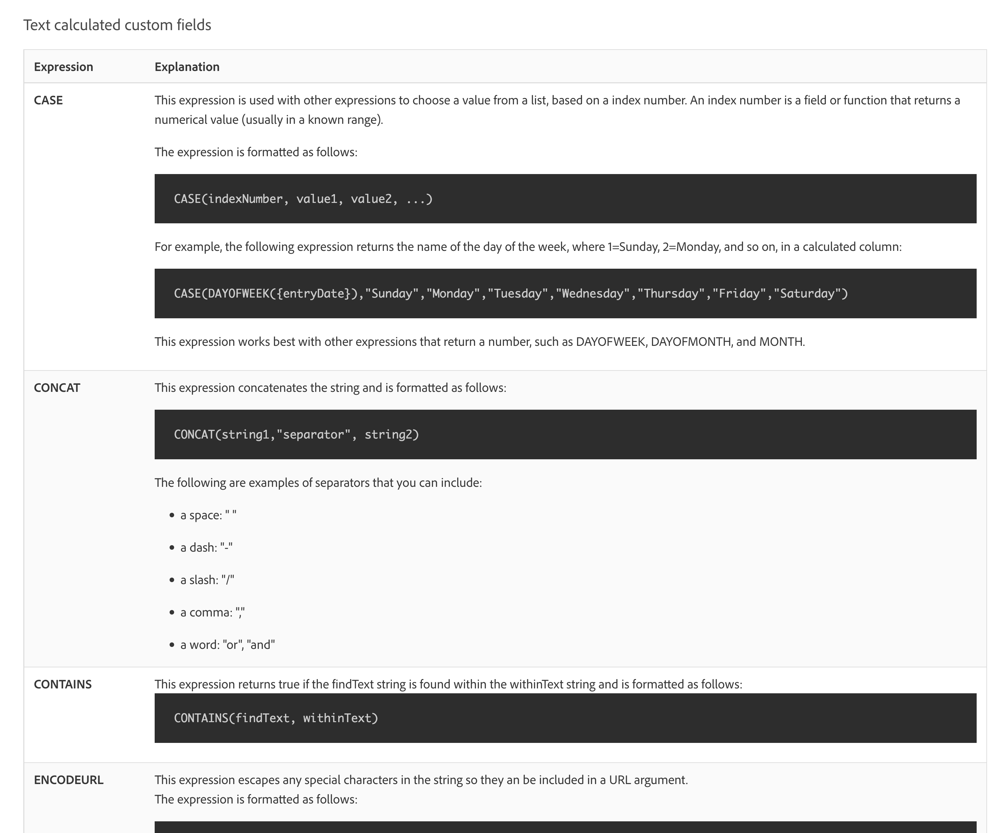

# 开始使用计算字段和表达式

<!--
**Note**: The expression examples shown are simple and some may be mitigated by fields already supplied by  . However, the examples are used to illustrate the foundational knowledge needed in order to build expressions in Workfront.
-->

Workfront 提供了在多个业务领域内均很常见的各种字段，并且经常用于工作管理。 规划完成日期、项目预算、任务受让人姓名等字段。

然而，每个组织都有特定于其行业和公司的数据，我们需要收集这些数据，以便了解公司目标是否得到实现。 例如，您的组织希望跟踪：

* 一个项目会为哪些业务领域做出贡献。
* 资金是来自供应商、内部或者两者兼有。
* 使用的图像需要什么样的分辨率。

尽管这些字段并非固有地内置在 [!DNL Workfront] 中，但您可以通过自定义表单创建自定义数据输入字段和预先填充的多选答案字段。

此学习路径侧重于计算字段。 您将了解到什么是计算字段、可以通过数据表达式提取到计算字段中的不同类型的信息，以及如何通过构建这些计算字段来增强数据收集和报告。

## 什么是计算字段？

计算字段包含使用数据表达式和现有 Workfront 字段创建的自定义数据。

例如，您的组织有一个特定的项目编号或工作编号系统，其中包括：

* 创建项目的年份，
* 项目所有者的姓名缩写，以及
* [!DNL Workfront] 项目参考号。

通过在计算字段中使用表达式，您可以获取已存储在 [!DNL Workfront] 中的每条信息，并创建唯一的项目 ID 或工作编号，然后可以将其添加到这样的报告中：

根据所需的具体数据，计算字段可以很简单（使用一两个表达式），也可以更复杂（使用多个嵌入表达式）。 请记住，Workfront 只能使用已经存储或拉入系统的数据来计算字段。

## 文字表达式

文本表达式会搜索、剖析并组合 [!DNL Workfront] 中的信息，以创建更有意义的数据或更深入地洞察为您的组织所做的工作。

例如，文本表达式可用于：

* 当项目支出超过 5000 美元时，在项目视图的列中显示“超过 5000 美元”，当支出低于 5000 美元时显示“低于 5000 美元”。

* 为每个项目提供一个唯一的编号，其中包括项目创建的年份、项目的 [!DNL Workfront] 参考编号、项目名称和项目所有者的姓名缩写。

* 构建一份报告，列出未分配给项目组合和/或项目群的每个项目，以便在经理会议中使用该信息。

文本表达式可以在自定义字段中用于在 Workfront 中进行这些类型的搜索和组合。

在查看可能的文本表达式时，您会发现几个选项。

最常用的文本表达式有六种：

* CONCAT
* LEFT / RIGHT
* CONTAINS
* IF
* ISBLANK