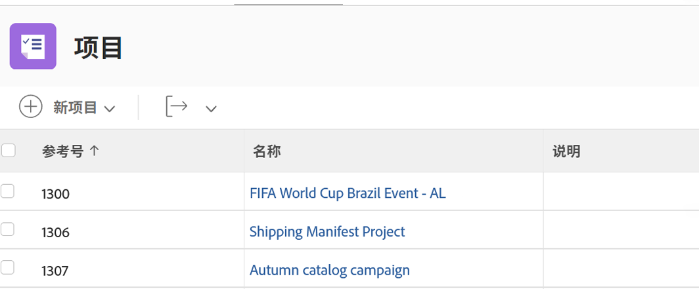
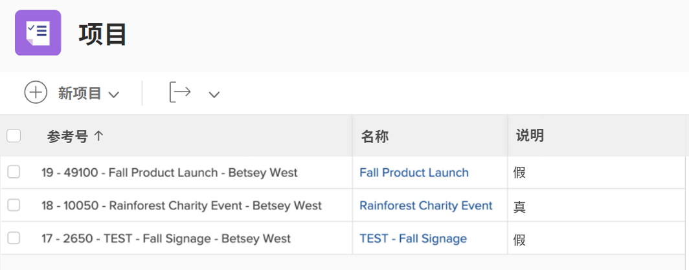
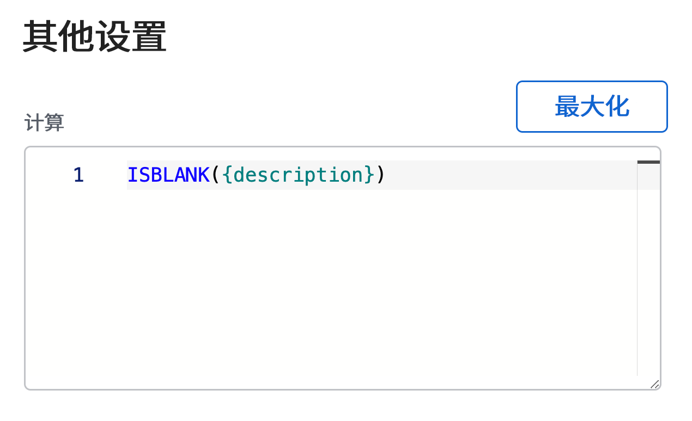
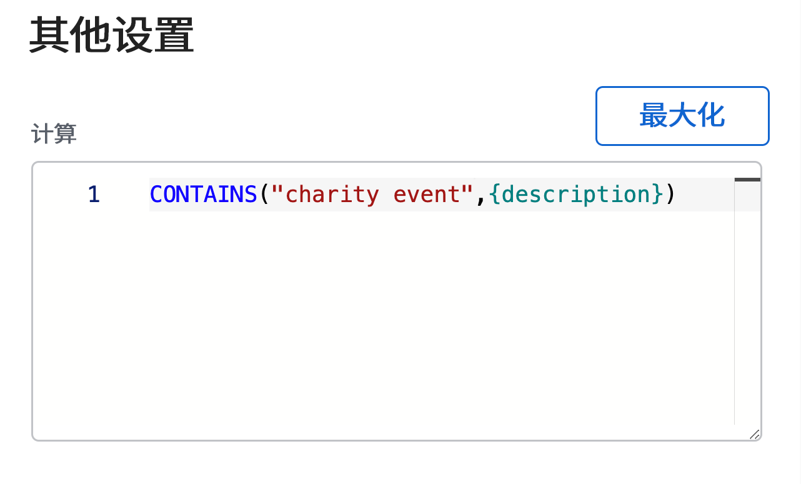

# 使用ISBLANK和CONTAINS表达式

CONTAINS和ISBLANK表达式都用于提供简单的true或false值。 区别在于ISBLANK表达式检查字段是否包含值，而CONTAINS文本表达式在字段中查找特定字符串。

例如，要查看项目是否包含描述，请使用ISBLANK表达式。 如果描述字段为空，则表达式会返回值true。 如果描述字段不为空，则返回值false。

要在描述中查找特定值（如“慈善活动”），请使用CONTAINS文本表达式。 如果在描述中找到“慈善活动”，则计算字段会显示“true”。 如果找不到“慈善活动”，则显示“false”。

## ISBLANK

ISBLANK文本表达式包含表达式的名称和一个数据点。

**ISBLANK（{数据点}）**

在上面的示例中（您想知道项目是否有说明的位置），表达式为：

ISBLANK({description})

## CONTAINS

CONTAINS文本表达式包括表达式的名称、您要查找的单词或短语以及要查找的字段。

**CONTAINS(&quot;phrase&quot;,{fields})**

请确保在要查找的单词或短语上加引号，否则表达式将无效。

在以上示例（在项目描述中查找“慈善活动”）中，表达式为：

**CONTAINS(&quot;charity event&quot;,{description})**

**注意**:CONTAINS表达式区分大小写。 例如，如果“慈善活动”在描述字段中大写，则在表达式中将该短语大写。

**CONTAINS(&quot;Charity Event&quot;,{description})**

如果要查看是否存在值，则可以使用ISBLANK和CONTAINS表达式。 但是，知道值是什么、实际查看值或使用某种描述符来提供更好的洞察信息，可能更有用。

例如，您不仅想知道某个项目已从请求进行了转换，还想知道原始请求的名称。

在这种情况下，将CONTAINS表达式与IF表达式结合使用。

ISBLANK和CONTAINS文本表达式经常与IF文本表达式一起使用。
