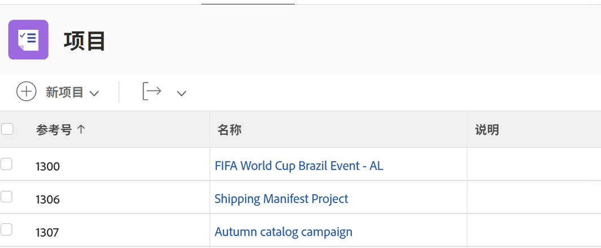
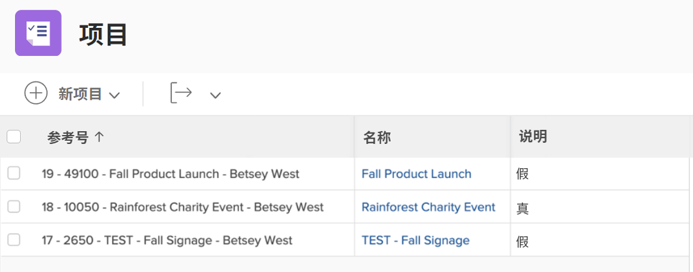
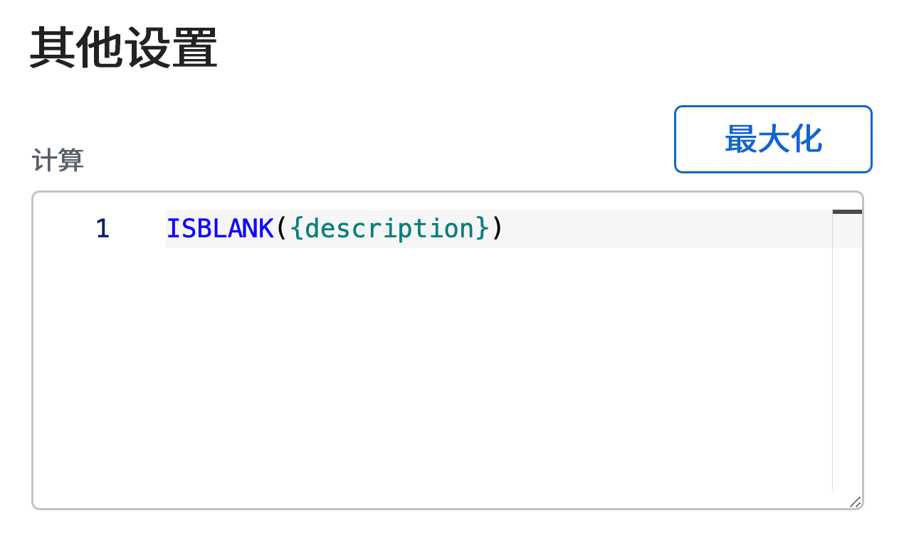
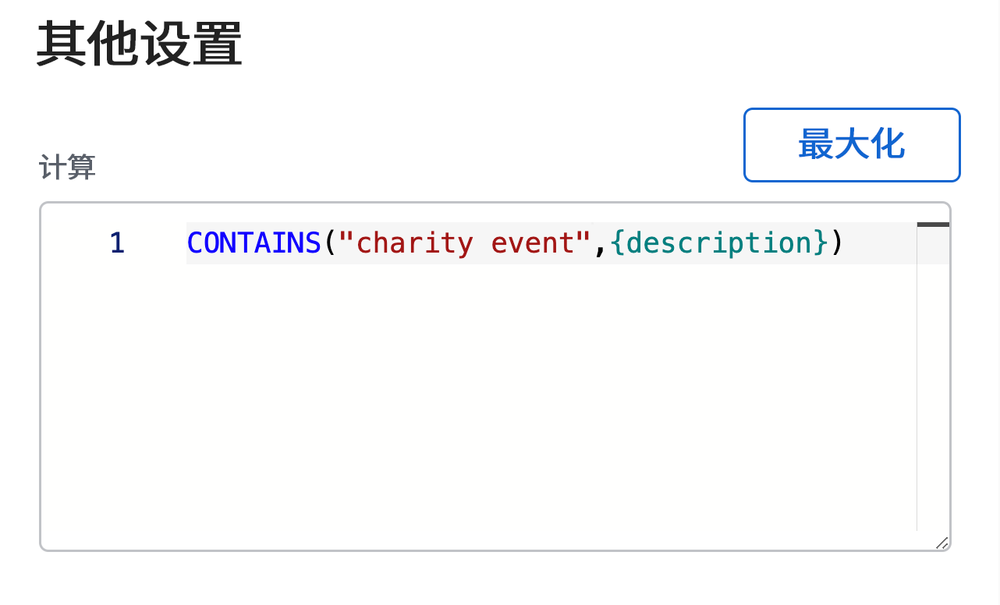

# 使用 ISBLANK 和 CONTAINS 表达式

CONTAINS 和 ISBLANK 表达式都可用于提供简单的 true 或 false 值。 其区别在于 ISBLANK 表达式会检查字段是否包含值，而 CONTAINS 文本表达式则会查找字段中的特定字符串。

例如，若要查看项目是否具有描述，则使用 ISBLANK 表达式。 如果描述字段为空，则表达式会返回 true 值。 如果描述字段不为空，则会返回 false 值。

要在说明中查找特定值（例如“慈善活动”），请使用 CONTAINS 文本表达式。 如果在描述中找到“慈善活动”，则计算字段将显示为 &quot;true&quot;。 如果没有找到“慈善活动”，则显示为 &quot;false&quot;。

## ISBLANK

ISBLANK 文本表达式包括表达式的名称和一个数据点。

**ISBLANK({data point})**

在上面的示例中，您想知道项目是否具有描述，则其表达式为：

ISBLANK({description})

## CONTAINS

CONTAINS 文本表达式包括表达式的名称、您要查找的单词或短语以及要查找的字段。

**CONTAINS(&quot;phrase&quot;，{fields})**

确保在您要查找的单词或短语两边加上引号，否则表达式将会无效。

在上面的示例中（在项目描述中查找“慈善活动”），其表达式为：

**CONTAINS（&quot;慈善活动&quot;，{description}）**

**注释**：CONTAINS 表达式区分大小写。 例如，如果“慈善活动”在描述字段中为大写，则在表达式中大写该短语。

**CONTAINS（“慈善活动”，{description}）**

如果您想查看某个值是否存在，那么 ISBLANK 和 CONTAINS 表达式都非常适合使用。 但是，了解值是什么、实际查看它或使用某种描述符来提供更好的洞察可能会更有帮助。

例如，您不仅想知道项目是从请求转换而来，您还想知道原始请求的名称。

在这种情况下，请将 CONTAINS 表达式与 IF 表达式结合使用。

ISBLANK 和 CONTAINS 文本表达式通常会与 IF 文本表达式一起使用。
