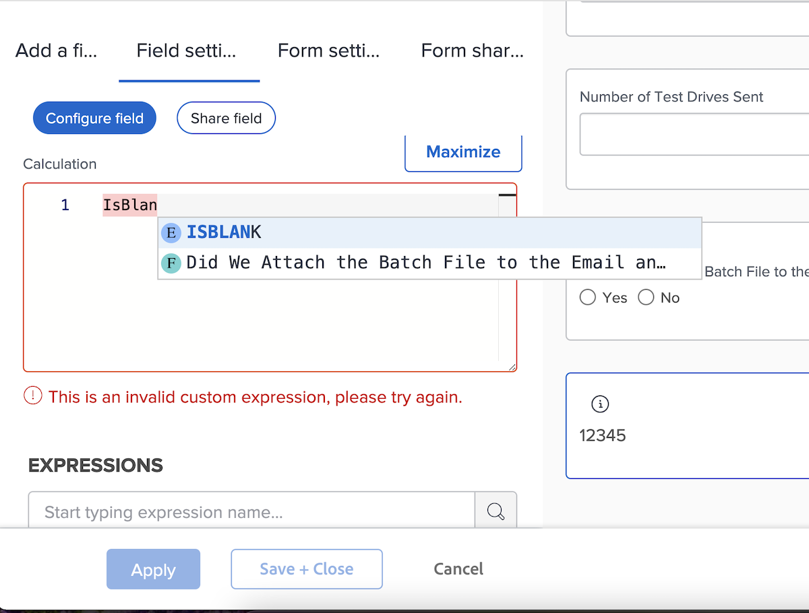
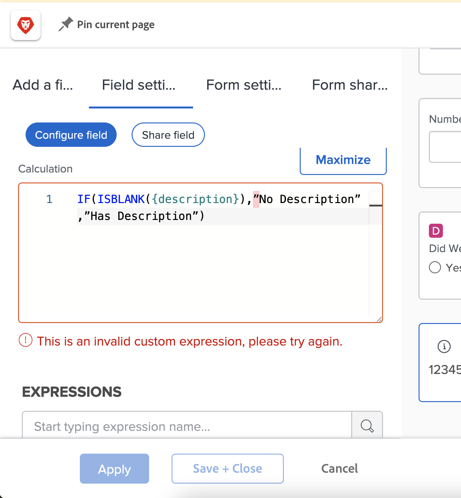
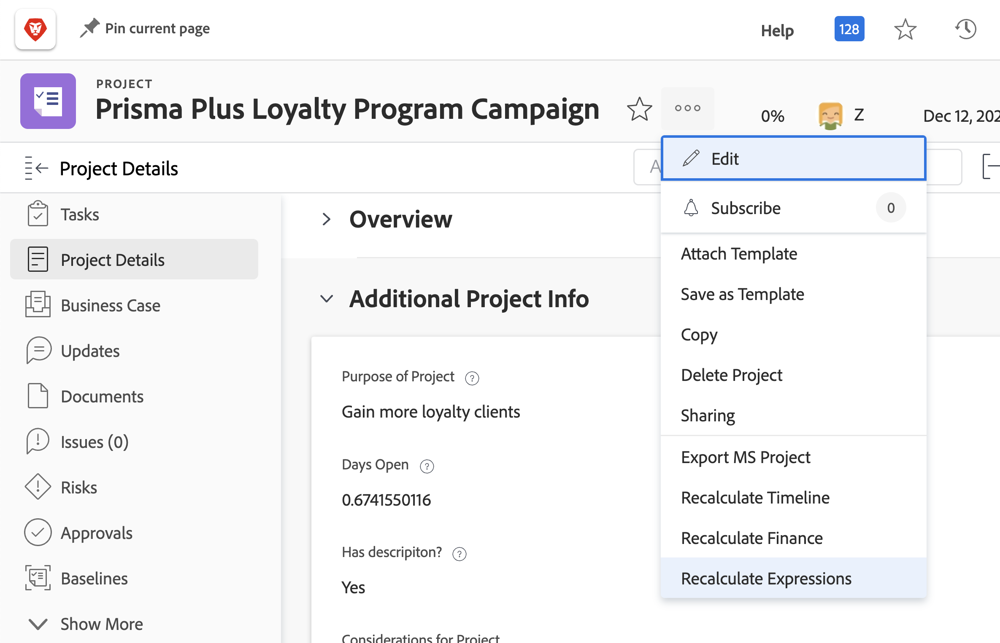

# 有关计算字段表达式的注意事项

以下是使用Workfront中的自定义计算字段时非常熟悉的概念列表。

## 表达式名称中的大小写问题

在表达式名称方面，大小写很重要。 最初编写表达式名称时，您可以使用大写、小写或两者的混合。

但是，必须将表达式写为所有大写字母，以便系统识别表达式并保存字段。

## 小时数以分钟为单位存储

Workfront数据库中的小时数以分钟为单位进行存储。 如果要引用“计划小时数”或“实际小时数”等字段，则除以60可显示时间（以小时而非分钟为单位）。

## 间距不影响表达式

建议使用在每个表达式之间几乎没有间距的方式来编写表达式。

* IF(ISBLANK({description}),&quot;No Description&quot;,&quot;Has Description&quot;)

但是，如果间距有助于您了解当前的情况，则可以将一些间距添加到表达式中。 额外的空格不应阻止表达式在 [!DNL Workfront].

* IF(ISBLANK({description})、“无描述”、“有描述”)

唯一不能在它们之间留有空格的，是字段和花括号。 否则，您将收到一条错误消息，并且无法保存字段或自定义表单。

## 引号必须为直

在表达式中使用引号时，请确保引号为直(&quot;)。 如果引号是弯曲的(&quot;)，则 [!DNL Workfront] 系统将继续显示“自定义表达式无效”消息。

## 在表单保存和对象编辑时更新计算

这是计算字段的一个重要方面，需要了解。

在计算字段中显示的信息将保持不变，并且会失效，除非重新计算自定义表单。

使用对象上更多菜单中的重新计算表达式选项可刷新表达式。

您希望查看问题的打开天数。 使用表达式DATEDIFF创建名为“Days Open”的计算字段。

* 字段名称=打开天数
* 表达式= DATEDIFF({entryDate},$$TODAY)

保存后，从首次创建或在Workfront中输入问题到今天的日期之间的间隔天数，可显示在对象的详细信息页面或报表视图中。

在查看同一详细信息页面或报表查看的次日，您预计该数字将递增1。 如果数字是今天的5，明天应该是6。 第二天应该是7，然后是8等。

但是，该字段将继续每天显示5个。 必须“重新运行”或重新计算字段才能刷新信息。

要使用“重新计算表达式”选项更新字段，请执行以下操作：

* 单击对象的名称以将其打开。
* 单击“更多”菜单。
* 从列表中选择重新计算表达式。

您还可以使用列表或报表中的“批量编辑”功能同时重新计算多个表达式。 假设您创建了一个报表，其中显示了一列中显示的“天数打开”计算问题列表。 如果要同时重新计算所有问题：

* 选择报表中的所有问题。
* 选择编辑选项可批量编辑所有选定的问题。
* 单击左侧的自定义Forms标签以向下滚动到自定义表单部分。
* 选中自定义Forms部分底部的重新计算自定义表达式框。
* 单击保存更改。

屏幕将刷新，以显示计算字段中的更新信息。

**注意**:尽管在计算量度字段中有其他更新或重新计算表达式的方法，但这是最快、最简单的方法。

## 在同一字段中，计算方式因表单而异

在自定义表单上保存计算字段并保存自定义表单后，该计算字段即会添加到字段库中，以便可用于其他自定义表单。

但是，如果表单A上有一个计算字段，而表单B上有相同的计算字段，则最初的想法是计算完全相同。 情况并非总是这样。 表单A上的计算字段可以在表单B上以完全不同的方式计算。

从字段库中选择计算的自定义字段并将其添加到自定义表单后，虽然该字段已添加，但计算为空。 出现这种情况的一个原因是，计算可能引用了其他对象类型中不存在的字段。

例如，您已创建一个计算字段“要完成的天数”，以确定完成项目中的任务需要多长时间。

* WEEKDAYDIFF({actualStartDate},{actualCompletionDate})

要对迭代执行相同的操作。 您可以使用相同的表达式；但是，任务对象可用的字段并非总是适用于迭代对象。 所以 [!DNL Workfront] 使您有机会使用正确的对象字段生成计算。

**Pro-Tip**:创建自定义字段时，将计算表达式从“计算”框复制到“说明”字段。 在从字段库将计算的自定义字段添加到自定义表单时，不会擦除该字段。

根据需要，自定义表单中的计算字段可能非常简单或非常复杂。 表达式可以嵌入或嵌套其他表达式和值，以提供所需的详细级别，以便更好地了解您组织中正在完成的工作的进展情况。

<!--Depending on the need, calculated fields in custom forms can be quite simple or very complex. Expressions can embed, or nest, other expressions and values to provide the level of detail needed to get a better picture of what is going on with the work being done at your organization. 

Most of the examples and exercises in this course have been relatively simple to provide a base understanding of the expressions most commonly used and how to build those expressions in a custom calculated field. 

Now you’re ready to start building your own calculated custom fields.-->
