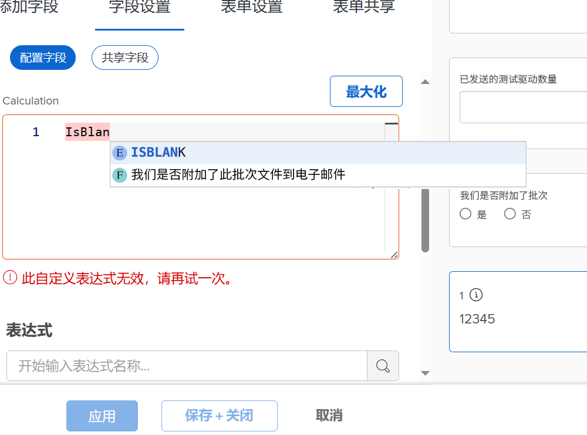
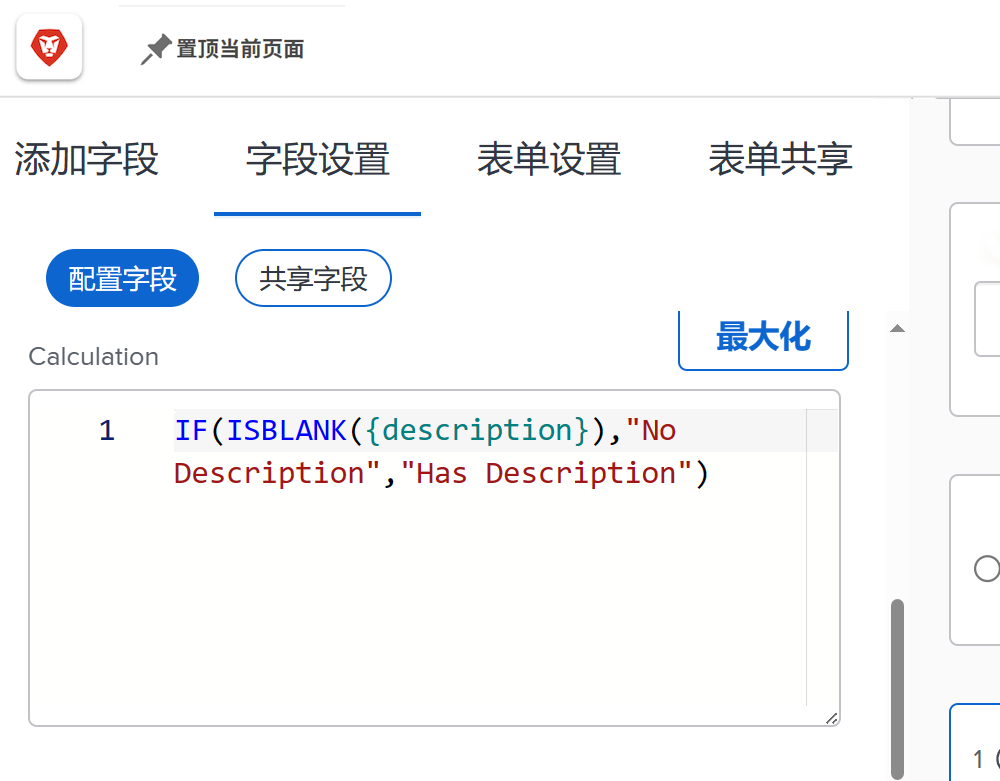
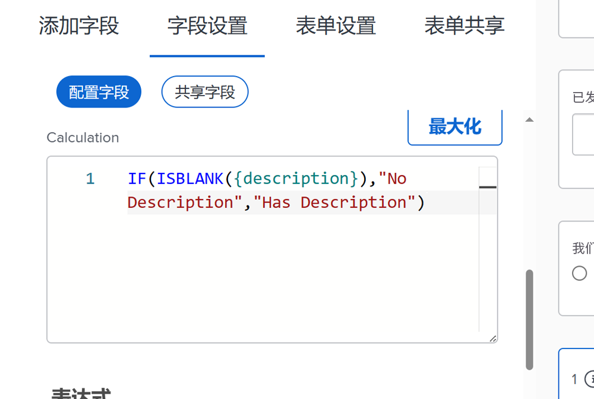
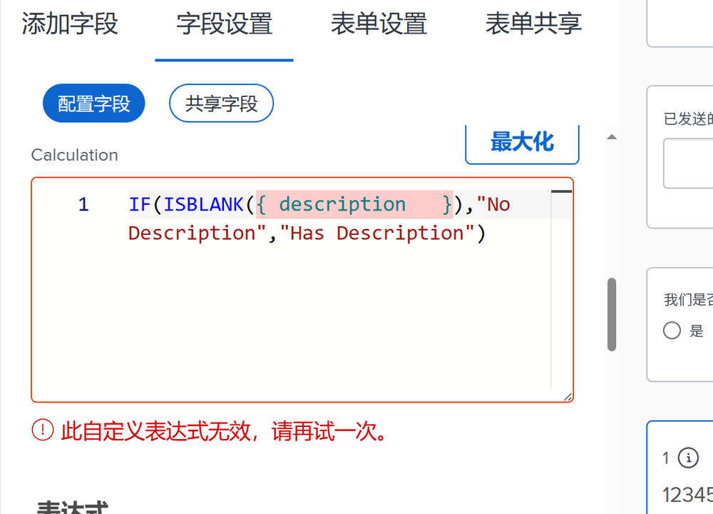
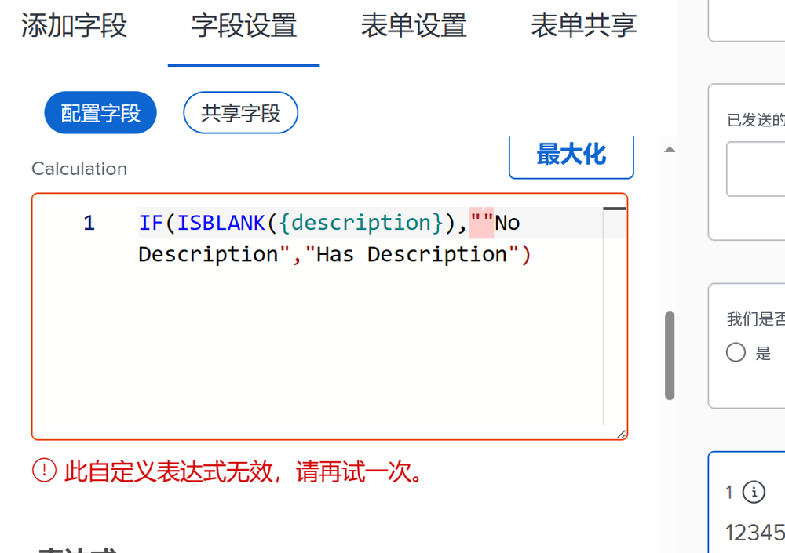
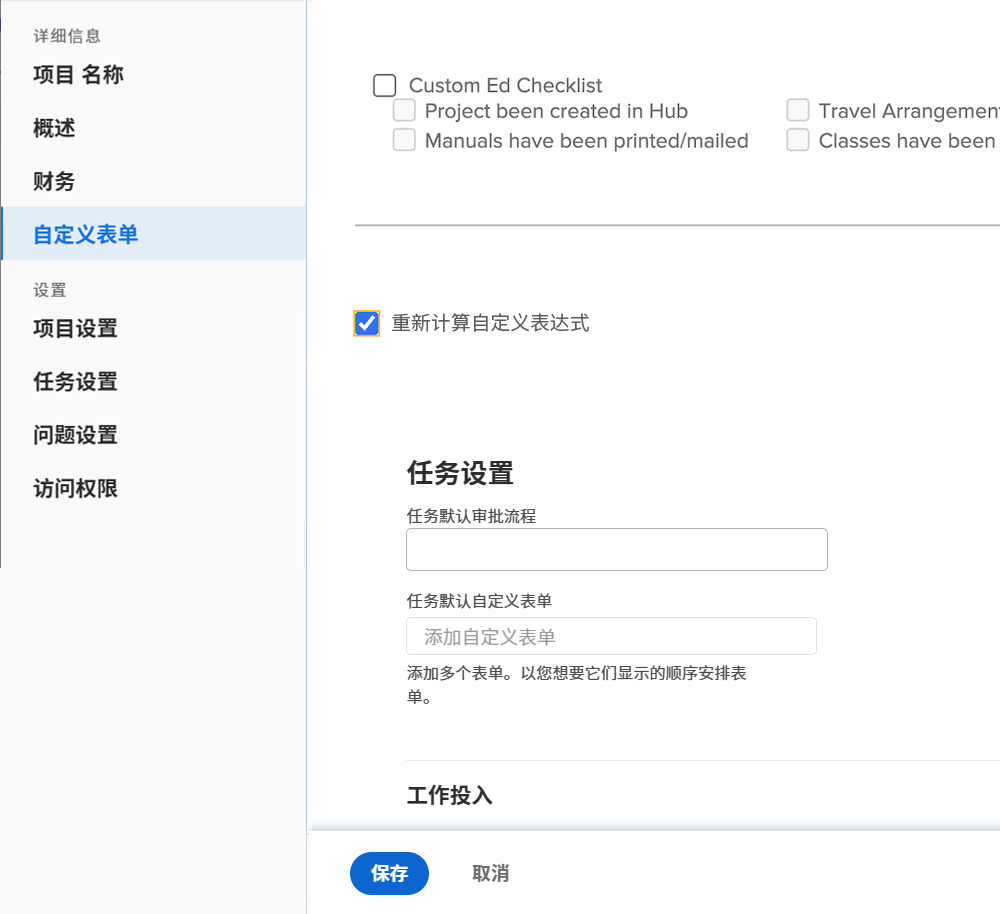

# 有关计算字段表达式的注意事项

以下是在Workfront中使用自定义计算字段时需要了解的概念列表。

## 在表达式名称中大小写很重要

对于表达式名称，大小写很重要。 最初编写表达式名称时，您可以使用大写、小写或两者的组合。

但是，表达式必须全部写入大写字母，系统才能识别表达式并保存字段。

## 小时以分钟为单位存储

Workfront数据库中的小时数以分钟为单位进行存储。 如果您引用的字段有计划小时数或实际小时数，则除以60可按小时而非分钟显示时间。

## 间距不影响表达式

推荐的表达式编写方法是，每个表达式之间只有很少的间距，甚至没有间距。

* IF(ISBLANK({description})，&quot;No Description&quot;，&quot;Has Description&quot;)

但是，如果间距可以帮助您了解所发生的情况，则可以向表达式中添加一些间距。 额外的空格不应阻止表达式在中收集或计算值 [!DNL Workfront].

* IF (ISBLANK ({description})， &quot;No Description&quot; ， &quot;Has Description&quot; )

字段和大括号是它们之间不能有空格的内容。 否则，您将收到一条错误消息，并且无法保存字段或自定义表单。

## 引号必须是直的

在表达式中使用引号时，请确保引号是直的(&quot;)。 如果引号为曲线(“)，则 [!DNL Workfront] 系统将继续显示“自定义表达式无效”消息。

## 表单保存和对象编辑时的计算更新

这是计算字段要了解的一个重要方面。

除非重新计算自定义表单，否则计算字段中显示的信息将保持不变，并会变得过时。

可以使用对象的“更多”菜单中的重新计算表达式选项刷新表达式。

您希望查看问题已打开的天数。 使用表达式DATEDIFF创建一个名为“Days Open”的计算字段。

* 字段名称=未结天数
* 表达式= DATEDIFF({entryDate}，$$TODAY)

保存后，首次创建问题或在Workfront中输入问题时与今天日期之间的间隔天数，可以显示在对象的详细信息页面或报表视图中。

在查看同一详细信息页面或报表查看时，您预期该数字将递增1。 如果今天的数字是5，明天就应该是6。 第二天应该是7，然后是8，以此类推。

但是，该字段将继续显示每天5个。 字段必须“重新运行”或重新计算才能刷新信息。

要使用“重新计算表达式”选项更新字段，请执行以下操作：

* 单击对象的名称以将其打开。
* 单击“更多”菜单。
* 从列表中选择重新计算表达式。

您还可以使用列表或报告中的“批量编辑”功能同时重新计算多个表达式。 假设您创建了一个报告，其中显示了一个列中显示未结天数计算的问题列表。 如果要一次重新计算所有问题，请执行以下操作：

* 选择报告中的所有问题。
* 选择编辑选项以批量编辑所有选定的问题。
* 单击左侧的自定义Forms标签向下滚动到自定义表单部分。
* 选中自定义Forms部分底部的重新计算自定义表达式框。
* 单击保存更改。

屏幕将刷新以显示计算字段中的更新信息。

**注释**：虽然有其他方法可更新或重新计算计算计算字段中的表达式，但这是最快且最简单的方法。

## 计算可能因同一字段中的表单而异

将计算字段保存到自定义表单并保存自定义表单后，计算字段即会添加到字段库，以便可用于其他自定义表单。

但是，如果表单A上有计算字段，表单B上有相同计算字段，则最初认为计算完全相同。 情况并非总是如此。 表单A上的计算字段可能是表单B上一种完全不同的计算方式。

从字段库中选择计算自定义字段并添加到自定义表单时，字段会添加，但计算为空。 出现这种情况的一个原因是，计算可能引用了对于其他对象类型不存在的字段。

例如，您已创建一个计算字段“完成天数”，以确定完成项目中的任务所需的时间。

* WEEKDAYDIFF({actualStartDate}，{actualCompletionDate})

您希望对迭代执行相同操作。 您可以使用相同的表达式；但是，可用于任务对象的字段并不总是可用于小版本对象。 So [!DNL Workfront] 让您有机会使用正确的对象字段构建计算。

**专业提示**：创建自定义字段时，将计算表达式从计算框复制到说明字段。 将计算出的自定义字段从字段库添加到自定义表单时，不会清除此字段。

根据需要，自定义表单中的计算字段可能非常简单或非常复杂。 表达式可以嵌入或嵌套其他表达式和值，以提供所需的详细信息级别，从而更好地了解组织中正在完成的工作的情况。

<!--Depending on the need, calculated fields in custom forms can be quite simple or very complex. Expressions can embed, or nest, other expressions and values to provide the level of detail needed to get a better picture of what is going on with the work being done at your organization. 

Most of the examples and exercises in this course have been relatively simple to provide a base understanding of the expressions most commonly used and how to build those expressions in a custom calculated field. 

Now you’re ready to start building your own calculated custom fields.-->
