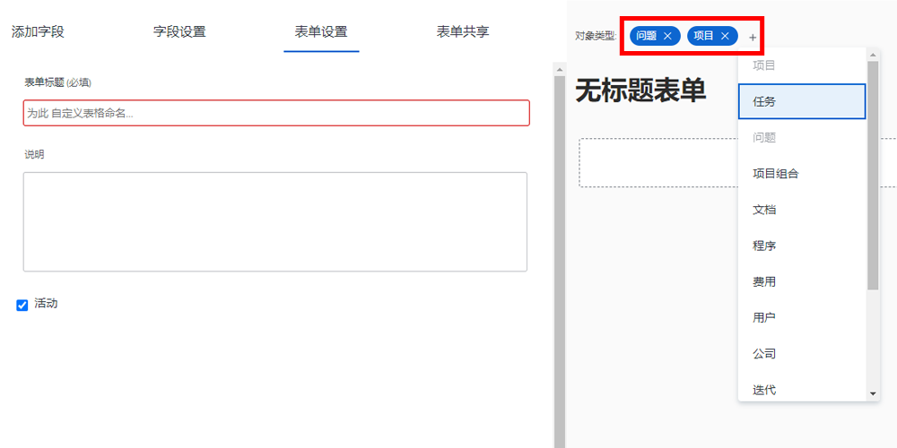

# 创建和共享自定义表单

在本视频中，您将了解如何：

* 确定要对表单使用的对象
* 以各种格式添加唯一字段
* 使用部分和逻辑组织字段
* 与其他用户共享表单

>[!VIDEO](https://video.tv.adobe.com/v/335172/?quality=12)

## 自定义表单适用于多个对象类型

当您单击 [!UICONTROL New Custom Form] 按钮时，您可以选择要在单个自定义表单中使用的任意数量的对象。 将自定义表单附加到任何选定对象时，您添加到此表单的所有字段都可供这些对象使用。

![自定义表单窗口显示 [!UICONTROL New Custom Form] 对象选项](assets/create-custom-form.png)

编辑自定义表单时，您可以看到所有选定的对象类型。 您可以在此列表中添加或删除对象类型。

您可能需要创建项目和问题类型的自定义表单。 附加到问题时，您可以填写与问题相关的任何字段。 稍后，如果您决定将问题转化为项目，自定义表单将自动加载到项目，您放置在问题自定义表单字段中的数据将可用于在项目自定义表单中查看或编辑。

## 自定义字段选项

**[!UICONTROL Label]和 [!UICONTROL Name] 字段**

此 [!UICONTROL Label] 和 [!UICONTROL Name] 自定义字段上的字段有不同的用途。 [!UICONTROL Label] 是用户将看到的字段名称 [!DNL Workfront]. [!UICONTROL Name] 是可与集成（例如API）一起使用的功能。

![自定义表单窗口显示 [!UICONTROL Label] 和 [!UICONTROL Name] 字段](assets/custom-forms-field-label-and-name.png)

这提供了灵活性，让您可以更改面向用户的标签以匹配组织中的更改，而不会影响依赖特定字段名称的集成或其他连接。

**[!UICONTROL Text Field with Formatting]**

此 [!UICONTROL Text Field with Formatting ]包含基本的文本标记工具，允许用户在自定义表单的字段中填写文本时添加粗体、斜体或下划线。

![自定义表单窗口显示 [!UICONTROL Text Field with Formatting] option](assets/custom-forms-text-field-with-formatting.png)

字段还有15,000个字符的限制，留出大量空间来提供重要信息，并使用格式设置让其他人易于阅读。

**[!UICONTROL Typeahead]字段**

此 [!UICONTROL Typeahead] 字段允许系统根据为该字段选择的对象自动填充选项列表。

![自定义表单窗口显示 [!UICONTROL Typeahead] 字段选项](assets/custom-forms-typeahead-1.png)

例如，如果您创建 [!UICONTROL Typeahead] 名为“营销经理审批名称”的字段，然后选择 [!UICONTROL User] 作为引用的对象类型，当用户填写自定义表单上的该字段时，将显示用户名列表。 此 [!UICONTROL Typeahead] 字段用于将自定义数据与系统中捕获的信息连接起来，而无需在下拉字段中手动维护许多选项。

![自定义表单窗口显示 [!UICONTROL Typeahead] 下拉菜单](assets/custom-forms-typeahead-2.png)
