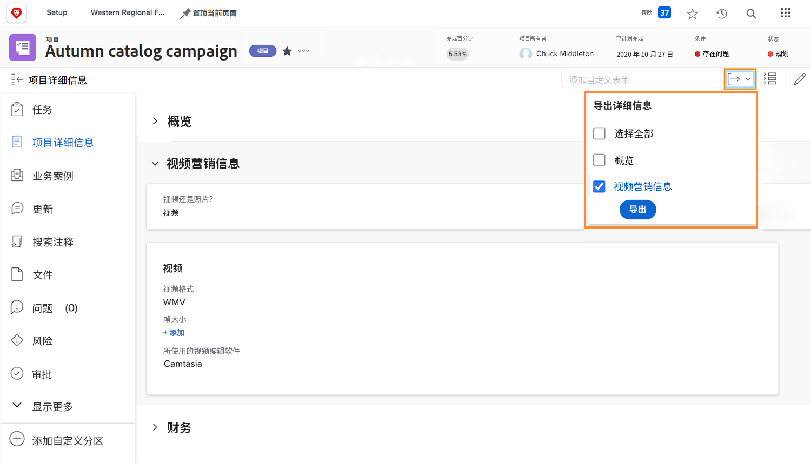

# 将自定义表单导出为PDF

捕获组织的独特数据是工作管理的重要组成部分。 自定义表单通常用于此目的。 能够导出自定义表单可轻松分发和共享这些表单。 在中访问表单时，您可以从项目、任务或问题中导出自定义表单 [!UICONTROL Details] 对象的部分。

您还可以包含 [!UICONTROL Overview] 导出PDF中的区域。

例如，要导出附加到项目的名为视频营销信息的自定义表单，请执行以下操作：

1. 单击 **[!UICONTROL Export]** 图标。 所有附加到项目的自定义表单都会显示在下拉菜单中，包括 [!UICONTROL Overview] 部分。
1. 从列表中选择“视频营销信息”。
1. 单击 **[!UICONTROL Export]** ，位于列表底部。

已下载格式化的PDF文件。

