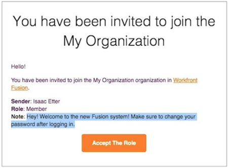

# 以新用户身份登录

当您被邀请作为 Workfront Fusion 实例的新用户时，您会收到两封电子邮件。

一封电子邮件包含 Workfront Fusion 系统管理员在创建您的配置文件并邀请您加入组织时添加的注释。 电子邮件的底部是 [!UICONTROL Accept The Role] 按钮。 **请暂时不要单击这个按钮！**

另一封电子邮件包含您的登录凭据。

要开始使用 Workfront Fusion，请单击第二封邮件中的 [!UICONTROL Sign In] 按钮，并使用提供的密码登录。

首次登录后，系统会提示您更改密码。

登录后，返回另一封电子邮件并单击 [!UICONTROL Accept The Role] 按钮。

完成此操作后，返回 Workfront Fusion 并刷新页面。 您现在可以在左侧面板中查看您的团队和概述部分。
