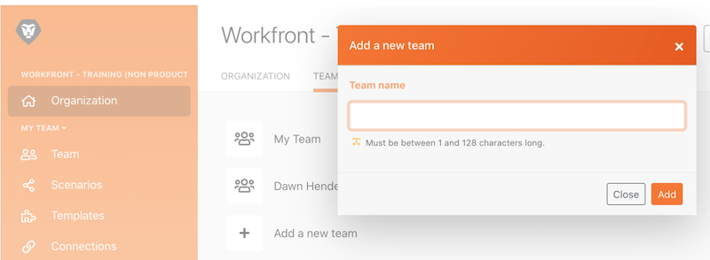

# 管理演练

了解在不同组织或团队之间切换，以及如何将用户添加到系统中。

## 管理演练

在本视频中，您将了解到：

* 如何在组织和团队之间导航
* 如何创建团队
* 如何邀请用户加入组织和团队

>[!VIDEO](https://video.tv.adobe.com/v/3418189/?captions=chi_hans&quality=12&learn=on&enablevpops=1)

>[!NOTE]
>
>如果您的组织已加入 Adobe Admin Console，请参阅[通过 Adobe Admin Console 将用户添加到 Adobe Workfront Fusion](https://experienceleague.adobe.com/docs/workfront/using/adobe-workfront-fusion/fusion-in-experience-cloud/add-fusion-users-admin-console.html?lang=zh-Hans)。

## 想要了解详情？ 我们建议查看以下内容：

[Workfront Fusion 文档](https://experienceleague.adobe.com/zh-hans/docs/workfront-fusion/using/get-started-with-fusion/understand-workfront-fusion/workfront-fusion-overview)
