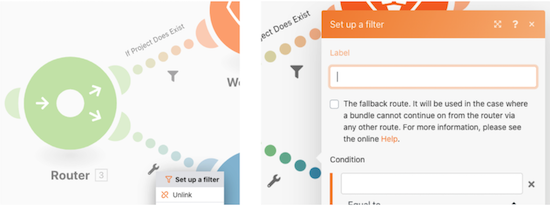

# 辅助功能和清晰度

在Workfront Fusion培训早期，您学习了一些使场景易于阅读、共享和理解的基本最佳实践。 这些实践有助于将来Workfront Fusion用户或任何对Workfront Fusion实例进行故障诊断或支持的人员更轻松地执行操作。 在设计场景时，请按照以下指南向前支付费用。

## 标签和注释

通常，Workfront Fusion的主要目标始终是设计简单的场景。 下面是一些用于制作易于解释的设计的方法。

* 确保您正在命名所有模块。 右键单击模块并选择重命名。 模块标签应简短且可理解模块所执行的操作。 例如，“使用模板创建Mktg项目。”
  
* 标记路由路径。 即使路径没有在路由器后直接使用过滤器，您也可以在不填写过滤器逻辑的情况下应用标签。 这样做可让其他人了解哪些捆绑包沿哪些路径传递，以及传递原因。 要为没有过滤器的路由器路径创建标签，请右键单击该路径，添加标签，然后保存。
  
* 如果模块标签或路由路径标签太短，无法明确说明实际发生的情况，请添加适合场景的注释。 在整个设计和迭代过程中，您可以根据需要随时添加注释。

但是，如果您在方案设计的最后、准备启动时添加注释，则可能最容易阅读和理解。 从场景设计的结尾（最底部、右角）向后工作。 这样，在打开注释面板时，应用于场景开头的注释将位于列表顶部。

保存或关闭“注释”面板后，注释将按最近创建的注释进行排序，并且位于顶部。 在下图中，创建的第一个注释显示在列表底部。 从右下角到上方的路径，最后到触发器，有意创建注释 — 本质上是按相反顺序排列的数据将通过场景。 这将使注释按照场景在数据包上实际执行的顺序显示。

## Workfront Fusion模板

简化模块和路由路径标签的一个好方法是使用模板。 最佳实践模板可以加快为常见用例创建方案的速度。

### 模板示例

在启动场景时，首先检查是否有可用的模板可用。 例如，您希望创建一个方案，该方案首先从Workfront下载CSV文档，然后解析它。

单击模板部分以查看是否有任何公共模板满足您的需求。

单击“团队模板”选项卡以查看您的团队中是否有人创建了可能有用的模板。

如果找到要使用的模板，请单击该名称以将其打开。

然后转到右上角，单击选项，然后选择创建方案。

### 创建模板

可以在“团队模板”部分中创建模板。 您创建的模板可供您和您的团队使用，但当您单击“发布”按钮时，您可以与团队外部的人员共享该模板。

在构建模板时，您可以包含一个向导，引导使用该模板的人构建场景，根据需要更改连接、映射的数据和其他面板字段。

选中“在向导中使用”复选框可添加说明，当有人使用您的模板构建方案时，将可以使用该说明。 此信息将显示在“帮助”字段中。 要允许用户在使用模板时查看此文本，请启用使用作为默认值。

## 想要了解更多信息？ 我们建议执行以下操作：

[Workfront Fusion文档](https://experienceleague.adobe.com/docs/workfront/using/adobe-workfront-fusion/workfront-fusion-2.html?lang=en)
