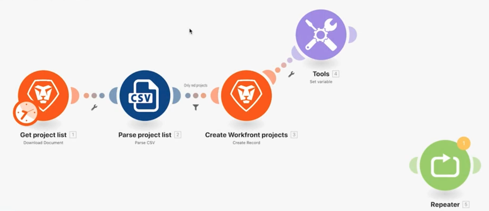

# 访问以前的版本

了解如何返回到方案的先前版本。

## 练习概述

了解在对方案进行更改并多次保存后，如何恢复以前的版本。

## 要遵循的步骤

1. 使用强大的过滤器方案克隆，并将其命名为“访问以前的版本”。
1. 在创建Workfront项目模块后添加一个Set变量模块。 将变量命名为“测试”。
1. 将其拖动到新位置并保存方案。

   

1. 添加中继器模块，将其与上一个模块取消链接，然后再次保存场景。

   

1. 现在删除所有模块并保存。
1. 在工具栏中，单击三个圆点菜单，然后单击“Previous Versions（以前版本）”选项。 选择列表会显示每个已保存版本的日期和时间戳。

   

1. 选择以前的版本，并注意设计器中的方案如何返回到保存的位置。
