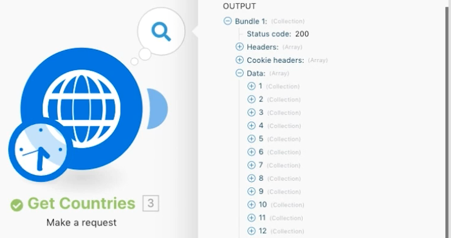

# 高级聚合练习

了解聚合时如何使用分组。

## 练习概述

调用网络服务返回多个国家/地区的详细信息，并确定所有国家/地区的总人口（按子区域分组）。

## 应遵循的步骤

**获取国家/地区详细信息。**

1. 创建一个新方案并将其命名为“高级聚合”。
1. 将触发器模块设置为 HTTP - 发出请求模块。
1. 使用这个 URL, `https://restcountries.com/v2/lang/es`，它会为您提供所有使用西班牙语的国家/地区的列表。
1. 将方法保留为“获取”。
1. 单击“解析响应”复选框。
1. 将此模块重命名为“获取国家/地区”。
1. 单击“保存”，然后单击“运行一次”。

   **输出是一个单独的捆绑包，但它是一个有 24 个集合的数组，每个西班牙语国家/地区一个。**

   

   **您需要收集每个国家/地区的子区域信息，因此您需要发出额外的 HTTP 请求。**

1. 添加另一个请求以获取子区域信息。它只会返回第一个国家/地区，但目前还可以。添加另外一个 HTTP 请求模块并使用该 URL `https://restcountries.com/v2/name/{country name}`。
1. 要获取第一个国家/地区的名称，请转到映射面板并单击“数据”，然后单击数组中的“名称”。数据字段中的 [1] 表示它将会返回数组中的第一项。

   + 单击数字并根据需要更改索引，但在本例中您只需要第一项。

1. 在映射面板中检查解析响应，然后单击“确定”。
1. 将此重命名为“获取国家/地区详细信息”。
1. 单击“保存”，然后单击“运行一次”。

   + 输出是单个国家/地区的信息。

1. 要获取其他国家/地区，您需要遍历数组。添加一个迭代器，它获取事物列表并为列表中的每个项目输出一个捆绑包。

   **添加迭代器和聚合器。**

1. 在 HTTP 模块之间右键单击并添加迭代器流控制模块。
1. 在数组字段中，从获取国家/地区模块中选择数据。

   

1. 在“获取国家/地区详细信息”模块中，更新 URL 字段以从迭代器而不是从“获取国家/地区”模块获取名称字段。

   

1. 现在，在“获取国家/地区详细信息”之后添加一个数字聚合器，以对人口进行分组和求和。
1. 源模块是迭代器模块。
1. 聚合函数是 SUM。
1. 该值为“获取国家/地区详细信息”模块中的 [data:population]。
1. 单击底部的“显示高级设置”选项，然后按“获取国家/地区详细信息”模块中的 [data:subregion] 分组。

   

   **最后使用文本聚合器来聚合您在数字聚合器中分组的内容。**

1. 在末尾添加一个文本聚合器。
1. 源模块是一个数字聚合器。
1. 在文本区域中，插入“[KEY] 的总人口为 [结果]。”

   

1. 保存并运行一次。

   + 查看最终模块的输出。
