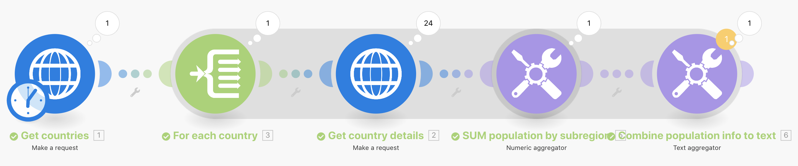

# 高级聚合

了解如何在聚合时使用分组。

## 练习概述

调用网络服务，返回有关多个国家的详细信息，并确定按次区域分组的所有国家的总人口。

## 要遵循的步骤

**获取国家/地区详细信息。**

1. 创建一个新方案并将其命名为“高级聚合”。
1. 将触发器模块设置为HTTP — 生成请求模块。
1. 使用此URL， `https://restcountries.com/v2/lang/es`，这将为您提供讲西班牙语的所有国家/地区的列表。
1. 将Method保留为Get。
1. 单击Parse response复选框。
1. 将此模块重命名为“获取国家/地区”。
1. 单击保存并运行一次。

   **输出是一个包，但它是以24个系列组成的阵列提供，每个西班牙语国家各一个。**

   

   **您需要收集每个国家/地区的次区域信息，因此您将需要提出额外的HTTP请求。**

1. 添加另一个请求以获取次区域信息。 它只会传回第一个国家，但现在还可以。 添加另一个HTTP创建请求模块并使用URL `https://restcountries.com/v2/name/{country name}`.
1. 要获取第一个国家/地区的名称，请转到映射面板并单击数据，然后单击数组中的名称。 此 [1] 在数据字段中，这意味着它将返回数组中的第一项。

   + 单击编号，并根据需要更改索引，但在此例中，您只需要第一项。

1. 在映射面板中选中“Parse response（解析响应）” ，然后单击“OK（确定）”。
1. 将此“获取国家/地区详细信息”重命名。
1. 单击保存，然后单击运行一次。

   + 输出是单个国家的信息。

1. 要获取其他国家/地区，您需要对数组进行迭代。 添加迭代器，它将获取一个项目列表并为列表中的每个项目输出一个捆绑。

   **添加迭代器和聚合器。**

1. 在HTTP模块之间单击鼠标右键，然后添加迭代器流量控制模块。
1. 在Array字段中，从Get Countries模块中选择Data。

   

1. 在获取国家/地区详细信息模块中，更新URL字段以从迭代器而不是获取国家/地区模块中获取名称字段。

   

1. 现在，在获取国家/地区详细信息后添加一个数字聚合器以对人口进行分组和总计。
1. 源模块是迭代器模块。
1. 聚合函数为SUM。
1. 值为 [data：population] 获取国家/地区详细信息模块。
1. 单击底部的“显示高级设置”选项，并按以下条件分组 [数据：子区域] 获取国家/地区详细信息模块。

   

   **最后，使用文本聚合器聚合您在数字聚合器中分组的内容。**

1. 在末尾添加文本汇总。
1. 源模块是数值汇总。
1. 在文本区域中，插入 [键] 是 [结果].”

   

1. 保存并运行一次。

   + 查看最终模块的输出。
