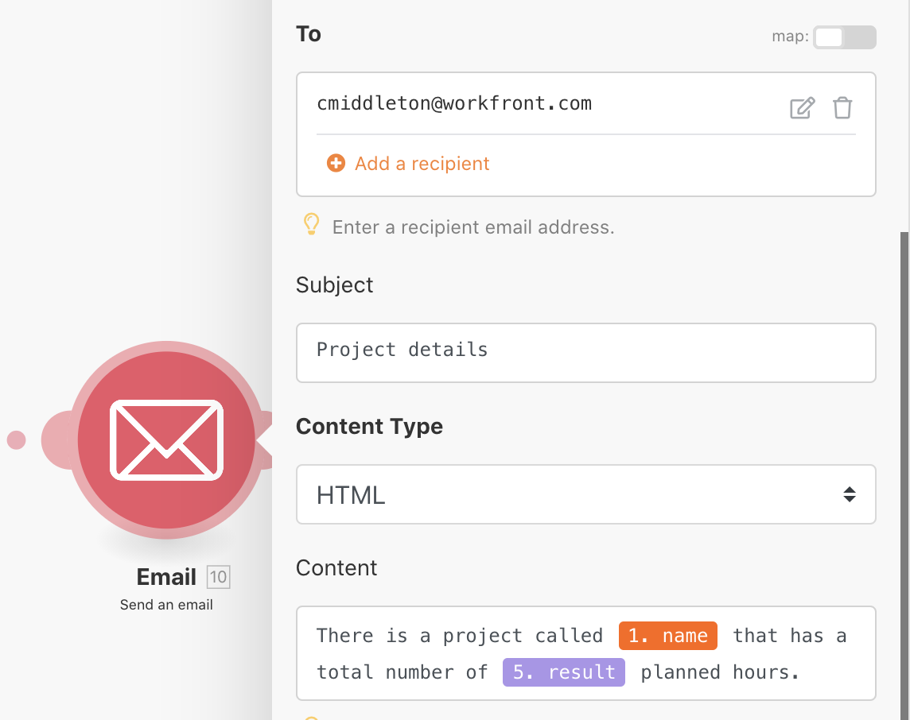

# 聚合

了解如何将多个信息捆绑包聚合为一个值。

## 练习概述

使用您在上一个练习中构建的“迭代简介”场景，汇总项目中每个工作任务的规划小时数，并向自己发送包含该信息的电子邮件。

## 应遵循的步骤

**添加过滤器并对规划小时数求和。**

1. 克隆您在上一个练习中创建的“迭代简介”场景，并将其命名为“聚合简介”。
1. 在“读取项目的任务”模块和“计算任务数”模块之间添加一个过滤器。将过滤器命名为“仅工作任务”。
1. 将条件设置为子任务数 [数字运算符：等于] 0。

   

1. 在“随机数学”模块之后，添加一个“数值聚合器”工具模块。
1. 将源模块设置为“读取项目的任务”。
1. 将聚合函数设置为 SUM。
1. 将“读取项目的任务”模块中的“值”设置为“工作”字段。
1. 将此模块重命名为“所有任务 pln 小时的总和”

   

   **请注意显示聚合结束迭代的阴影。**

   

   **发送包含聚合时间的电子邮件。**

1. 在数字聚合器之后添加来自电子邮件应用程序的发送电子邮件模块。
1. 将电子邮件发送给自己。
1. 主题行为“项目详细信息”
1. 在“内容”字段中，输入“有一个名为 [项目名称] 的项目，其总体规划小时数为 [结果]。”“[项目名称]”取自读取记录模块，“[结果]”取自聚合器模块。

   

1. 保存并运行一次。在收件箱中找到该电子邮件。

在迭代中，可以访问各个捆绑包。但在迭代之外，在发送电子邮件模块中，只能访问聚合字段。
