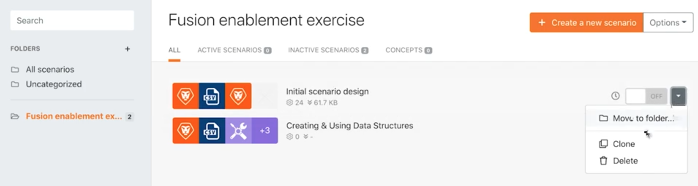

# 超出基本映射

了解如何使用映射面板公式来操作或转换发送到模块的字段。

## 练习概述

使用映射面板公式从“超出基本映射范围”演练中更改项目名称、计划开始日期和优先级。

## 要遵循的步骤

**克隆初始方案设计方案。**

1. 在方案部分中选择初始方案设计右侧的克隆选项，如下所示。 将其命名为“Beyond basic mapping”。

   

   **现在，我们将使用“创建Workfront项目”模块中的映射面板来配置项目名称、计划开始日期和优先级字段。**

1. 单击创建Workfront项目模块以编辑设置。 使用映射面板，将名称字段更改为&quot;[我的项目名称] 作者： [发起人].”

   + 此 [我的项目名称] 是解析CSV模块中的列1，并且 [发起人] 是第6栏。 “by”一词只是输入在两者之间。

1. 接下来，转到计划的开始日期，并使用addDays公式向字段添加15天，如超出基本映射演练视频中所述。
1. 找到“优先级”字段并切换该字段右上角的映射按钮。 选取列表菜单将更改为数字。 如果CSV文件置信度等级小于100，则创建一个if语句以将项目标记为高(4)优先级，否则可为正常(2)。

   + 置信度级别位于第4列中。

   **此时，映射面板应如下所示：**

   

1. 单击“OK（确定）” ，然后单击“Run once（运行一次）”。
1. 在Workfront实例中找到项目，以确保正确映射了所有内容。
1. 保存您的方案。
