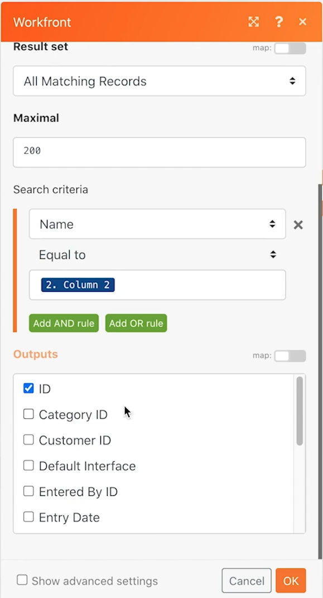
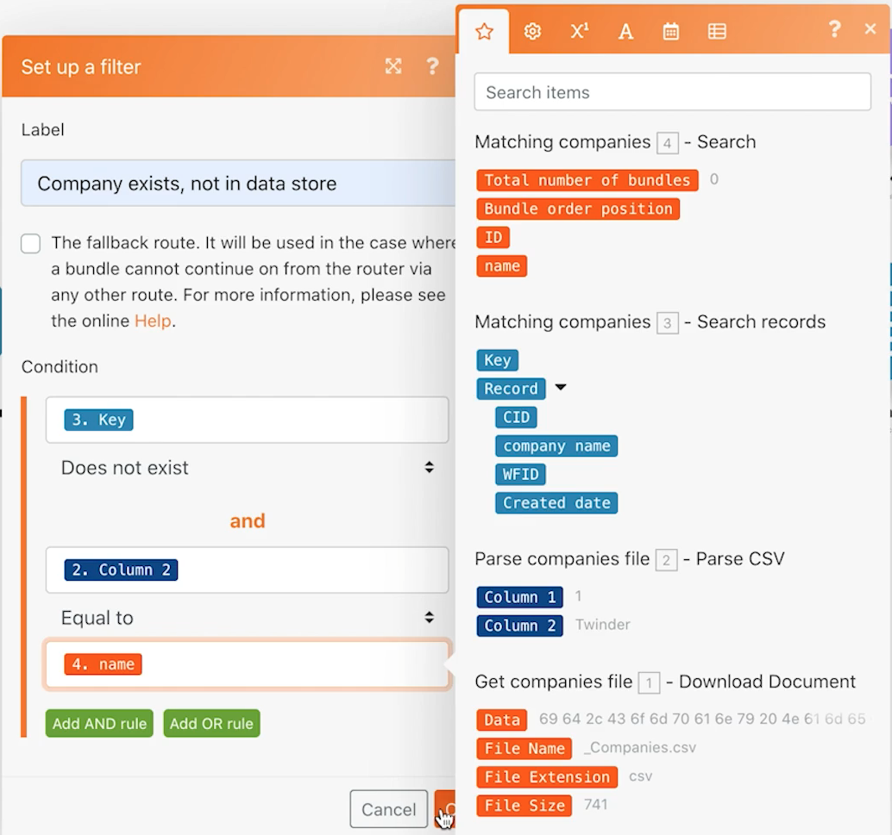

# 数据存储练习

了解如何在两个系统之间同步公司名称。

## 练习概述

这是 Workfront 和另一个系统中公司单向同步的第一部分。目前，仅可在 Fusion 数据存储和 Workfront 之间同步。数据存储中的表格会跟踪每个公司的 Workfront ID (WFID) 和 CSV 文件中的公司 ID (CID)。这允许在将来的某个时刻进行双向同步。

## 应遵循的步骤

**从 Workfront 下载文件。**

1. 在 Workfront“Fusion 练习文件”文件夹中，选择“_Companies.csv”并单击“文档详细信息”。
1. 复制 URL 地址中的第一个 ID 号。
1. 在 Fusion 中，创建一个名为“使用数据存储同步数据”的新场景。
1. 对于触发器模块，选择“Workfront 下载文档”模块。
1. 设置您的 Workfront 连接，并包含从 Workfront URL 复制的文档 ID。
1. 将此模块命名为“获取公司文件”。
1. 现在添加一个解析 CSV 模块。
1. 对于“列数”字段，输入“2”。
1. 映射 CSV 字段中“下载文档”模块中的数据。
1. 将此模块命名为“解析公司文件”。
1. 保存您的场景并单击“运行一次”。

   **创建数据存储和数据结构。**

1. 添加数据存储搜索记录模块。
1. 创建一个名为“公司同步”的新数据存储。
1. 在该数据存储中，创建一个名为“公司同步 (struc)”的数据结构。
1. 创建四个字段。

   + CID - CSV 文件中的公司 ID
   + 公司名称
   + WFID - Workfront 公司 ID
   + 创建日期 - 确保数据类型为日期

   

1. 单击数据结构上的“保存”，然后将数据存储大小设置为“1”，并保存数据存储。
1. 继续在“数据存储”模块中，设置一个过滤器，其中 CID 等于解析 CSV 模块中的公司 ID（第 1 列）。
1. 单击“显示高级设置”并选择“继续执行场景或路径，即使此模块返回没有结果”选项。

   

1. 将此模块重命名为“匹配公司”。
1. 添加 Workfront 搜索记录模块。
1. 选择“公司”作为记录类型。
1. 搜索条件是 Workfront 中的公司名称与 CSV 文件中的公司名称相同。
1. 对于输出，选择公司名称和 ID。

   

1. 单击“确定”并将该模块重命名为“匹配公司”。

   **根据公司是存在于 Workfront 还是数据存储中，创建不同的路径。**

   **路由路径 1 - 创建一个公司。**

1. 在 Workfront 搜索记录模块的右侧添加一个路由器模块。
1. 将 Workfront 创建记录模块添加到顶部路径。
1. 将记录类型设置为“公司”。
1. 从要映射的字段中选择名称。将名称字段映射到解析 CSV 模块的输出（第 2 列）。
1. 将此模块重命名为“创建公司”。

   

1. 在路由器后添加一个过滤器，以仅创建未存在于 Workfront 的公司。将其命名为“不在 Workfront 中”。
1. 将“条件”设置为 Workfront 搜索模块中的 ID，但不存在。

   

   **准备在下一个路径中更新数据存储。**

1. 将“设置变量”模块添加到顶部路径的末尾。
1. 将变量名称设置为“Workfront ID”。
1. 将变量值设置为创建公司模块中的 ID。
1. 将此模块重命名为“设置 Workfront ID”。

   **路由路径 2 - 更新数据存储。**

1. 在路由路径 2 上创建一个过滤器。将其命名为“不在数据存储中”。

1. 将“条件”设置为数据存储模块中的键并且不存在。

   

1. 此路径中的第一个模块是“获取变量”模块。
1. 将变量名称设置为“Workfront ID”。
1. 将此模块重命名为“获取 Workfront ID”。
1. 从数据存储应用程序添加另一个模块，添加/替换记录。
1. 在数据存储字段中，选择“公司同步”。这是您之前创建的数据存储。
1. 将“键”字段留空。
1. 从解析 CSV 模块中的第 1 列映射 CID 字段。
1. 映射解析 CSV 模块中第 2 列的公司名称字段。
1. 映射“获取 Workfront ID”模块中的 WFID 字段。
1. 对于“创建日期”字段，使用日期和时间选项卡中的 formatDate 函数将当前日期格式化为 MM/DD/YYYY。

   

1. 单击“确定”并将该模块重命名为“创建公司条目”。

   **路由路径 3-在系统之间同步数据存储。**

1. 首先在路由路径 3 上创建一个过滤器。将其命名为“公司存在，不在数据存储中”。
1. 将“条件”设置为数据存储搜索记录模块中的键并且不存在。
1. 单击“添加 AND 规则”按钮，并指定 CSV 文件中的公司名称（第 2 列）与 Workfront 搜索模块中找到的公司名称相同。

   

1. 现在，通过克隆路由路径 2 末尾的模块来添加另一个“添加/替换记录”模块。
1. 将克隆的模块拖到路由路径 3 末尾的位置。删除此处的空模块。
1. 单击克隆的模块。除 WFID 字段外，所有字段均应保持不变。从匹配公司搜索模块中进行映射。

   

1. 单击“确定”并将该模块重命名为“创建公司条目”。
