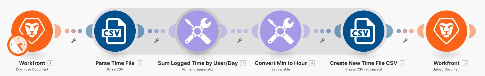

# 数据结构练习

将数据从源文件转换为目标文件。

## 练习概述

打开包含时间条目列表的 CSV 文件。这些时间条目是多个用户在某些天记录的分钟数。我们的目标是使用此信息生成一个新的 CSV，其中显示每个用户每天记录的总时间（以小时为单位）。

在此场景中，您将会打开一个文件，其中包含工作分钟数的时间条目列表，其中包括日期和时间、输入的分钟数以及输入者的电子邮件地址。这其中有 100 个时间条目，有些是同一个人产生的，有些是其他人在同一天产生的。

要生成显示每个人每天工作总时间（以小时为单位）的文件，请按照以下步骤操作：

1. 在触发器模块中，从 Workfront 文件夹中获取一个文件。下载该文件。
1. 在第一个 CSV 模块中，解析时间条目数据，为每个时间条目输出一个捆绑包。这是一个迭代器。
1. 第一个工具模块是数字聚合器。这会对所有分钟进行求和，并依次按电子邮件地址和日期对行进行分组。其结果是每个电子邮件每天工作的总分钟数。
1. 第二个工具模块是“设置变量”模块。使用此选项将分钟格式化为除以 60，并四舍五入到小数点后两位。
1. 在第二个 CSV 模块中，设置输出文件。
1. 在最后一个模块中，将 CSV 文件上传到 Workfront。

## 应遵循的步骤

**从 Workfront 下载文件。**

1. 在 Workfront“Fusion 练习文件”文件夹中，选择 &quot;_Fusion1.0JanTime.csv&quot; 并单击“文档详细信息”。
1. 复制 URL 地址中的第一个 ID 号。
1. 创建新场景。将其命名为“创建和使用数据结构”。
1. 从 Workfront 应用程序中的“下载文档”模块开始。
1. 设置您的 Workfront 连接，并包含从 Workfront URL 复制的文档 ID。

   

   **解析时间条目数据。**

1. 添加另一个模块，选择“解析 CSV”。
1. 为七列设置解析 CSV。选中“CSV 包含标题”框。选择逗号分隔符类型，并在 CSV 字段中放入数据。

   

1. 单击“运行一次”以查看输出。
1. 打开执行检查器，查看解析 CSV 模块的输入和输出。其中会有一个捆绑包（一个 CSV 文件）作为输入，并有多个捆绑包作为输出（CSV 文件中的每一行一个捆绑包）。这应该如下所示：

   

   **接下来，将数据转换为所需的输出形式，其中聚合时间总计以小时而不是分钟表示。**

1. 添加数字聚合器工具模块。
1. 选择源模块，即解析 CSV 模块。
1. 选择 SUM 作为聚合函数。
1. 该值字段是 CSV 文件中的第 7 列。这是每个用户记录的分钟数。
1. 要按组对字段求和，请单击“高级设置”并将“分组依据”设置为电子邮件（第 4 列）、日期（第 5 列）。

   + 这将会对电子邮件和日期的每个组合进行求和。请务必在第 4 列和第 5 列之间添加逗号。稍后这将会用作分隔符。

   **您的映射面板应如下所示：**

   

1. 单击“运行一次”以检查聚合输出。

   **输出捆绑包应如下所示：**

   

   **现在将汇总的分钟数转换为小时数。**

1. 添加另一个工具模块，选择“设置变量”。
1. 将变量命名为“小时”。
1. 将变量值设置为 formatNumber(result/60;2;.;,)

   **您的映射面板应如下所示：**

   

   **接下来，获取为输出文件设置的值。您需要用于分组的用户 ID 和日期值。您还需要计算出的小时数。**

1. 使用聚合器“创建 CSV（高级）”添加另一个模块——CSV 模块。
1. 源模块是 Tools - Numeric 聚合器。
1. 单击“数据结构”字段旁边的“添加”，并将我们的数据结构命名为“每日记录的时间总和”。
1. 单击“添加项目”以创建第一个项目。
1. 将该项目命名为“用户 ID”并将类型设置为“文本”。单击“添加”。
1. 再次单击“添加项目”以创建第二个项目。
1. 将项目命名为“日期”，将类型设置为“日期”，然后单击“添加”。
1. 再次单击“添加项目”。
1. 将项目命名为“小时数”，将类型设置为“数字”，然后单击“添加”。

   **您的数据结构应该是这样的：**

   

1. 单击“保存”完成“每日记录的时间总和”数据结构。

   **现在为刚刚创建的三个字段提供值。您应该会在 CSV 映射面板中看到这三个字段。**

1. 单击用户 ID 字段，然后从常规功能选项卡中选择 GET。在第一个参数中，从文本和二进制函数选项卡中放入 SPLIT。SPLIT 函数的第一个参数是 Key 字段。添加逗号作为分隔符，添加 1 作为索引。这表示您希望 GET 检索 Key 数组中的第一个字段。
1. 将此表达式复制到日期字段中。将索引从 1 更改为 2，以获取数组中的第二个值。
1. 对于“小时”字段，在“设置变量”工具中添加“小时数”字段。

   **您的 CSV 映射面板应如下所示：**

   

   **如果您现在运行该场景，您应该会看到以下输出：**

   

   **现在，添加一个模块来获取此输出，并将其作为文档上传到 Workfront 中的现有项目。**

1. 在 Workfront 中打开项目并从 URL 复制项目 ID。
1. 返回 Fusion 中的场景并添加另一个模块——Workfront 应用程序中的上传文档模块。
1. 将项目 ID 粘贴到“相关记录 ID”字段中。
1. 选择“项目”作为相关记录类型。
1. 为源文件选择“映射”选项。
1. 对于文档名称，请使用您下载的文件名，并在其前面添加“已更新”。
1. 对于文件内容，请使用“创建 CSV”模块的文本输出。

   **您的映射面板应如下所示：**

   

1. 单击“确定”并“保存”场景。
1. 单击“运行一次”以运行场景。

   **检查“上传文档”模块中的执行检查器，以确认文档已上传。**

   
