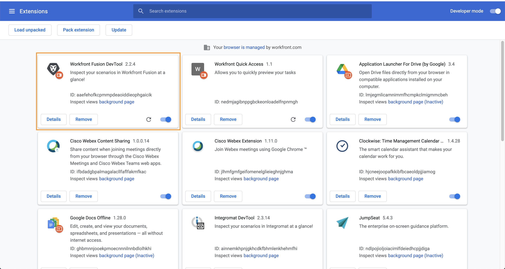
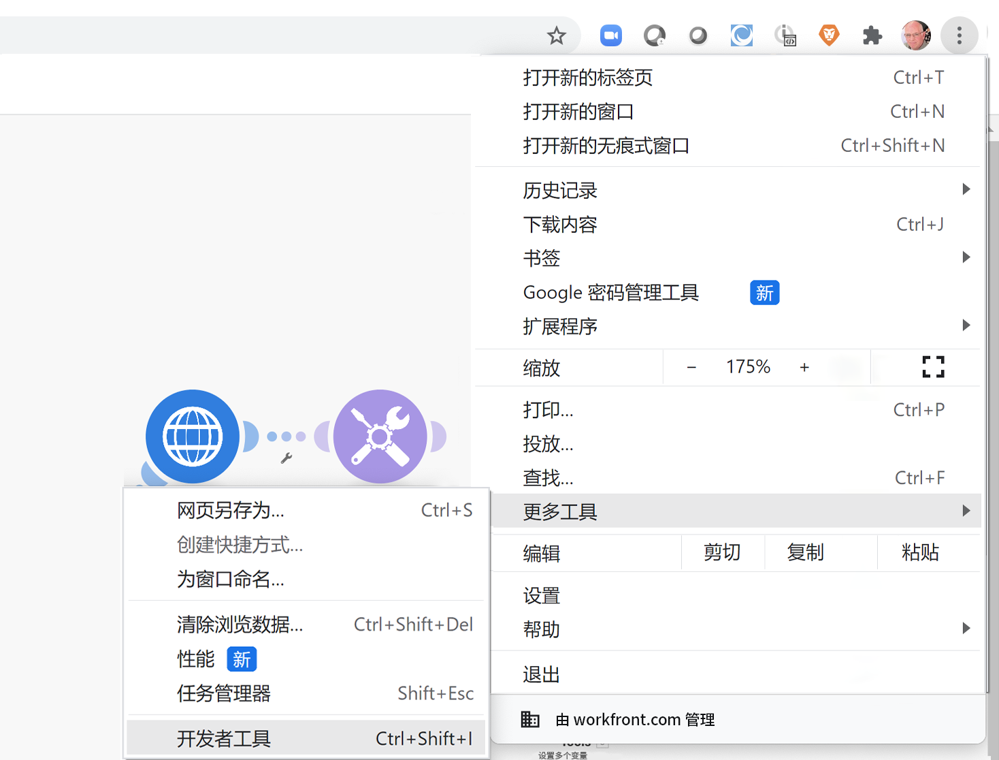

# 开发工具练习

增强您对场景进行故障排除的能力，并使用开发工具简化复杂的配置。

## 练习概述

安装并使用 Workfront 开发工具中的不同区域，以更深入地了解提出的请求/响应以及高级场景设计技巧。

>[!NOTE]
>
>Workfront Fusion 开发工具仅在使用 [Chrome 开发者工具](https://developer.chrome.com/docs/devtools/)时在 Chrome 浏览器中可用。

## 应遵循的步骤

**安装开发工具。**

1. 下载测试版中 Fusion 练习文件文件夹中的“workfront-fusion-devtool.zip”文档。
1. 将 Zip 文件解压到一个文件夹中。
1. 在 Chrome 中打开一个选项卡并输入 **chrome://extensions**。
1. 使用右上角的开关开启开发者模式，然后单击左上角出现的“加载未打包内容”按钮。选择包含开发工具的文件夹（这是您将其解压缩的位置）。

   

1. 解压后，开发工具将会出现在您的其他扩展中。

   

   **使用“直播”。**

1. 首先打开“使用数据存储同步数据”场景。
1. 通过键入 F12 或函数 F12 打开开发工具。或者，您可以单击 Chrome 地址栏中的三点菜单并导航到“开发人员工具”。

   

1. 单击 Workfront Fusion 选项卡，然后从左侧列表中选择“直播”。
1. 单击“运行一次”以查看发生的事件。
1. 单击事件可在右侧查看“请求标题”、“请求正文”、“响应标题”和“响应正文”的选项卡。

   

   **使用场景调试器**

1. 选择“场景调试器”并单击一个模块来查看有关该模块的操作的信息。

   

1. 导航到“历史记录”选项卡。单击执行任务的“详细信息”可检查特定执行任务的模块操作详细信息。

   

   **使用这些工具**

1. 返回场景设计器并选择开发工具中的“工具”。这将会显示可用的工具。

   

+ 聚焦模块 - 使用模块 ID 快速查找并打开模块。
+ 通过映射查找模块 - 使用关键词搜索场景以查找模块中的映射值和/或键。
+ 获取应用程序元数据 - 查看所选应用程序场景的元数据。
+ 复制映射 - 将映射从一个模块复制到另一个模块。您还可以在设计器中克隆模块。
+ 复制过滤器 - 复制过滤器。过滤器总是会分配给其右侧的模块。
+ 交换连接 - 该工具从选定的模块获取连接，并为场景中同一应用程序的所有模块设置相同的连接。如果您必须在整个已完成的场景中更改连接，这会很有帮助。使用此工具有助于避免丢失所有映射并节省时间。
+ 交换变量 - 查找整个场景或一个模块中给定变量的所有出现情况，并将其替换为新变量。不支持通配符。如果您不小心在整个场景中映射了某个值，这可以帮助您轻松交换为正确的值。
+ 交换应用程序 - 将给定应用程序交换为另一个应用程序。
+ BASE 64 - 将输入的数据编码为 Base64 或解码 Base64。当您想要在经过编码的请求中搜索特定数据时很有用。
+ 复制模块名称 - 将选定的模块名称复制到剪贴板。
+ 重新映射源 - 将映射源从一个模块更改为另一模块。您需要首先将要用作源模块的模块添加到场景中的路由中。
+ 迁移操作系统 - 专门用于将 Google Sheets（旧版）模块升级到最新的 Google Sheets 版本。它在场景路由中的模块的以前版本之后添加了该模块的新版本。
