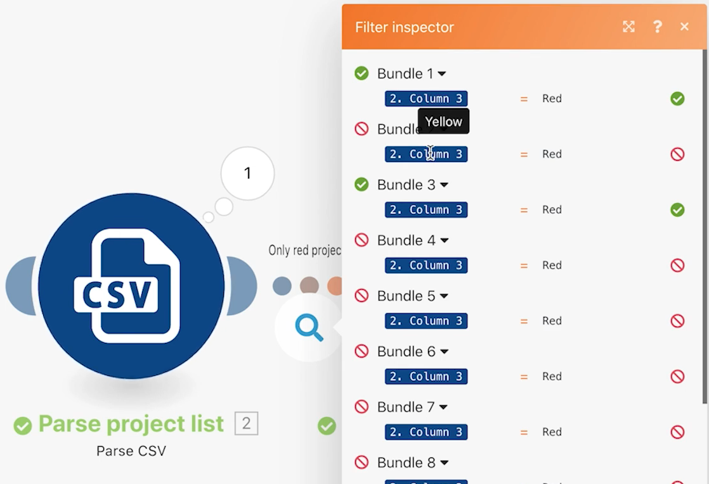

# 筛选器

了解如何在模块之间使用过滤器，以仅允许特定类型的包通过。

## 练习概述

在“超出基本映射”方案的两个模块之间添加一个过滤器，以便仅创建在CSV文件中具有“红色”项目颜色的项目。

## 要遵循的步骤

1. 创建“超出基本映射”方案的克隆，并将其命名为“使用强大过滤器”。

   **在创建Workfront项目模块之前添加过滤器，以仅允许创建红色项目。**

   

1. 通过单击连接模块的虚线或单击扳手并选择“设置过滤器”来添加过滤器。
1. 使用“标签”字段将过滤器命名为“仅红色项目”。
1. 在条件字段中，映射项目颜色字段（CSV文件中的列3）。 选择等于（不区分大小写）运算符，然后键入“红色”。
1. 单击确定。

   

   **测试过滤器并验证结果。**

1. 单击保存以保存方案，然后单击运行一次。
1. 单击筛选器的执行检查器可查看筛选器如何检查每个包，以及如何传递或未能继续移动到创建Workfront项目模块。

   

1. 查找在Workfront实例中创建的项目。
