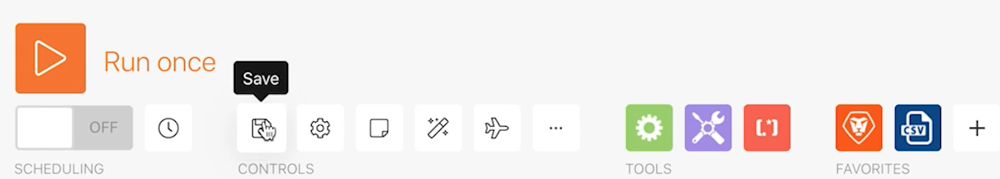

# 初始方案设计

了解首次登录Workfront Fusion时的一些基本导航提示，以及构建第一个情景。

## 练习概述

在Workfront中为项目列表CSV文件中的每一行创建新项目。

## 要遵循的步骤

1. 在名为“融合启用练习”的场景部分中创建一个文件夹。
1. 单击到文件夹中，然后单击创建新方案。

   

1. 在下一页中，搜索Workfront并选择该应用程序。 然后，单击继续。
1. 在方案设计器屏幕的左上角，将方案重命名为“初始方案设计”
1. 单击屏幕中心的空触发器模块，选择Workfront应用程序，然后选择“下载文档”模块。

   **验证模块与Workfront帐户的连接。**

1. 要首次创建连接，请单击“添加”按钮。

   

1. 为连接命名，如“我的Workfront 2020”

   

1. 输入Workfront实例的URL，然后单击下一步。

   

1. 输入密码，然后单击“Log in（登录）”。

   **连接已建立。 现在，输入要从Workfront下载的文档的文档ID。**

   

1. 回Workfront。 在“Fusion Exercise Files”文件夹中，选择“_Fusion2020_Project List.csv”，然后单击左侧面板中的“文档详细信息”。 从URL地址复制文档ID号（这是URL中的第一个长号）。

   

1. 返回到“Fusion”，并在“文档ID”字段中粘贴该数字，然后单击“确定”。
1. 最佳做法是在创建模块时对其进行重命名。 右键单击Workfront模块，然后选择“重命名”。 将模块命名为“获取项目列表”。

   **接下来，您将解析刚刚下载的CSV文件，以便可以访问文件中的每一行。 在从每行创建项目时，您将使用此信息。**

1. 单击Workfront模块的右侧以添加其他模块。 搜索CSV应用程序，然后选择解析CSV模块。
1. 为6列设置解析CSV ,CSV包含标题、逗号分隔符类型，并将数据放入CSV字段。 然后，单击“确定”。

   

1. 将此模块重命名为“解析项目列表”。
1. 在方案设计器的底部，单击保存以保存方案。
1. 单击运行一次以查看输出。

   >[!NOTE]
   >
   >忽略以下警告：变压器不应是最后一个模块（这是事实，但对于此测试来说无关紧要）。 单击“仍然运行”。

   

1. 在解析CSV模块中打开执行检查器，以查看模块的输入和输出。 有一个包（CSV文件）作为输入，多个包作为输出（CSV文件中每行都有一个包）。 它应该如下所示：

   

   **添加一个模块，以便为CSV文件中的每一行创建项目。**

1. 添加其他模块。 选择Workfront应用程序，选择创建记录模块。
1. 将记录类型设置为项目。

   >[!TIP]
   >
   >通过开始键入几个字母(例如 *proj*，直接转到它。

1. 然后，使用Cmd/Ctrl+G查找名称（项目名称）。 选中“名称”(Name)旁边的复选框；字段显示在下面。
1. 现在，选中“计划的开始日期”和“优先级”旁边的复选框。
1. 单击“名称”字段，以显示映射面板。 单击解析CSV模块中的Column 1字段，将其添加到“名称”字段。 这是CSV文件中的项目名称。
1. 对于计划的开始日期，单击解析CSV模块中的列5。
1. 对于“优先级”，从下拉菜单中选择“普通”。

   **映射面板应当如下所示：**

   

1. 单击确定。

   >[!NOTE]
   >
   >如果您没有单击“确定”，并意外地再次单击到设计器中，则您的工作不会保存，您将必须再次映射。

1. 右键单击Workfront模块，并将其重命名为“创建Workfront项目”。
1. 保存方案并单击运行一次按钮。
1. 单击最后一个模块右上方的执行检查器。

   + 您将看到已执行20次操作。 每个操作都从CSV文件中获取一个包（即一行），作为输入和输出一个包，该包是在Workfront中创建的项目。 创建的项目的项目ID随输出包一起显示。

   

   **使用注释**

1. 注释有助于使方案设计更加直观。 要向创建Workfront项目模块添加注释，请右键单击并选择添加注释。 设计器窗口右侧的面板弹出，以便您可以向模块添加注释。 在“创建从CSV文件映射的具有名称、计划开始日期和优先级的项目”中键入。
1. 添加另一个注释以描述触发器模块(第一个Workfront模块)正在执行的操作。
1. 单击右上角的X以关闭注释面板。

   + 再次访问注释，方法是单击底部工具栏中的注释按钮，或右键单击任何模块并添加新注释。
   + 注释按时间顺序逆序排序。
   + 添加注释后，“注释”按钮上会显示一个橙色圆点。

   

1. 单击控件工具栏中的保存按钮以保存方案。
1. 您可以查看在Workfront实例中创建的项目。
