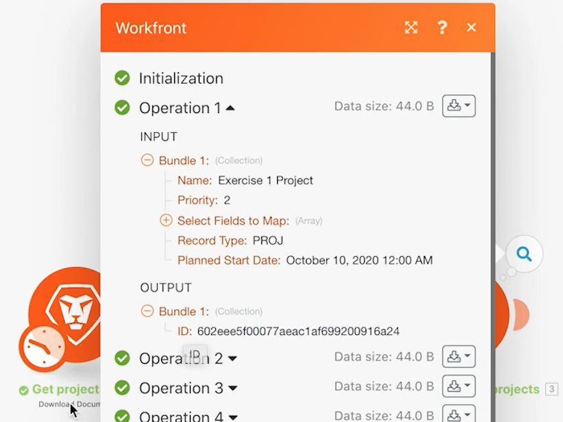

# 初始场景设计练习

了解首次登录 Workfront Fusion 以及构建第一个场景时的一些基本导航提示。

## 先决条件

1. 此练习需要 Workfront 测试版。您可以填写[该表格](https://forms.office.com/r/f1J8HRGrNY)请求获得该版本。如果您无法访问该表格，请将您的姓名、电子邮件地址和公司名称发送至 wfttstdr@adobe.com。
1. Fusion 练习假设您已经观看了与练习相对应的演练视频。在这种情况下，相对应的视频是[初始场景设计演练](https://experienceleague.adobe.com/docs/workfront-learn/tutorials-workfront/fusion/understand-the-basics/initial-scenario-design-walkthrough.html?lang=zh-Hans)。

## 练习概述

在 Workfront 中为项目列表 CSV 文件中的每一行创建一个新项目。

## 应遵循的步骤

1. 在“场景”部分中创建一个名为“Fusion 支持练习”的文件夹。
1. 单击进入该文件夹，然后单击“创建新场景”。

   

1. 在下一页上，搜索 Workfront 并选择该应用程序。然后单击“继续”。
1. 在场景设计器屏幕的左上角，将场景重命名为“初始场景设计”
1. 单击屏幕中央的空触发器模块，并选择 Workfront 应用程序，然后选择“下载文档”模块。

   **验证该模块与您的 Workfront 帐户的连接。**

1. 在连接到Workfront实例之前，您需要先在该Workfront实例中创建OAuth 2.0连接器。 若要登录Workfront实例，请转到&#x200B;**设置>系统> OAuth2应用程序**，然后单击&#x200B;**创建应用程序集成**。

   填写表单的第一页，如下所示，然后单击&#x200B;**创建**。

   

1. 当下一个屏幕出现时，在&#x200B;**重定向URL**&#x200B;字段中填写以下URL：

   `https://app.workfrontfusion.com/oauth/cb/workfront-workfront`

   

1. 然后单击&#x200B;**添加客户端密钥**&#x200B;按钮。 此时将显示客户端密码。 复制该模板并将其保存在可检索它以供将来步骤使用的位置。 在您的Fusion场景中需要它。 还复制并保存&#x200B;**客户端ID**&#x200B;以供将来步骤使用。 完成复制后，单击应用程序底部的&#x200B;**保存**。

   

1. 返回Fusion后，单击“**添加**”按钮以创建与Workfront的连接。

   

1. 选择&#x200B;**Adobe Workfront身份验证**&#x200B;作为连接类型，并选中&#x200B;**显示高级设置**&#x200B;框。 然后单击&#x200B;**继续**。

   

1. 使用您之前保存的&#x200B;**客户端ID**&#x200B;和&#x200B;**客户端密钥**&#x200B;在此处填写。 对于&#x200B;**身份验证URL**，最简单的方法是复制字段下给定的默认身份验证URL，并将`oauth.my`替换为`<domain name>.testdrive`，然后单击&#x200B;**继续**。

   

1. 您的连接应该正在进行身份验证。 您可能需要登录到Workfront。 单击&#x200B;**允许访问**。

   

   **此时连接已建立。现在输入您要从 Workfront 下载的文档的文档 ID。**

   

1. 返回 Workfront。在“Fusion 练习文件”文件夹中，选择 &quot;_Fusion2020_Project List.csv&quot;，然后单击左侧面板中的“文档详细信息”。复制 URL 地址中的文档 ID 号（URL 中的第一个长数字）。

   

1. 返回 Fusion 并将数字粘贴到“文档 ID”字段中，然后单击“确定”。
1. 最佳实践是在创建模块时对其进行重命名。右键单击 Workfront 模块并选择“重命名”。将模块命名为“获取项目列表”。

   **接下来，您将会解析刚刚下载的 CSV 文件，以便可以访问文件中的每一行。当您从每一行创建一个项目时，您将会用到此信息。**

1. 单击 Workfront 模块的右侧来添加另一个模块。搜索 CSV 应用程序并选择“解析 CSV”模块。
1. 设置 6 列的解析 CSV, CSV 包含标题、逗号分隔符类型，并将数据放入 CSV 字段。然后，单击“确定”。

   

1. 将此模块重命名为“解析项目列表”。
1. 在场景设计器的底部，单击“保存”以保存您的场景。
1. 单击“运行一次”以查看输出。

   >[!NOTE]
   >
   >忽略有关转换程序不应是最后一个模块的警告（事实是这样的，但对于此测试并不重要）。单击“仍然运行”。

   

1. 打开解析 CSV 模块上的执行检查器，查看模块的输入和输出。其中会有一个捆绑包（一个 CSV 文件）作为输入，并有多个捆绑包作为输出（CSV 文件中的每一行一个捆绑包）。这应该如下所示：

   

   **添加一个模块来为 CSV 文件中的每一行创建一个项目。**

1. 添加另一个模块。选择 Workfront 应用程序，然后选择“创建记录”模块。
1. 将记录类型设置为“项目”。

   >[!TIP]
   >
   >通过开始输入几个字母来搜索它，例如 *proj*，然后直接转到它。

1. 然后使用 Cmd/Ctrl+G 查找“名称”（项目名称）。选中“名称”旁边的框；该字段会在下面出现。
1. 现在选中“规划开始日期”和“优先级”旁边的框。
1. 单击“名称”字段以显示映射面板。单击“解析 CSV”模块中的“第 1 列”字段，将其添加到“名称”字段。这是 CSV 文件中的项目名称。
1. 对于“规划开始日期”，单击“解析 CSV”模块中的“第 5 列”。
1. 对于优先级，从下拉菜单中选择“正常”。

   **您的映射面板应如下所示：**

   

1. 单击“确定”。

   >[!NOTE]
   >
   >如果您未单击“确定”，并且意外单击“返回设计器”，您的工作将不会保存，您需要重新映射。

1. 右键单击 Workfront 模块并将其重命名为“创建 Workfront 项目”。
1. 保存您的场景并单击“运行一次”按钮。
1. 单击最后一个模块右上角的执行检查器。

   + 您会看到执行了 20 次操作。每个操作都从 CSV 文件中获取了一个捆绑包（即一行）作为输入，并会输出一个捆绑包，这是在 Workfront 中创建的项目。所创建的项目的项目 ID 会与输出捆绑包一起出现。

   

   **使用注释**

1. 注释有助于提高场景设计的可视性。要将注释添加到“创建 Workfront 项目”模块，请右键单击并选择“添加注释”。设计器窗口右侧会弹出一个面板，以便您可以向该模块添加注释。输入“使用从 CSV 文件映射的名称、规划开始日期和优先级创建项目”。
1. 添加另一个注释来描述触发器模块（第一个 Workfront 模块）正在执行的操作。
1. 单击右上角的“X”关闭注释面板。

   + 单击底部工具栏中的“注释”按钮或右键单击任何模块并添加新注释，即可再次访问注释。
   + 注释按时间倒序排列。
   + 添加注释后，“注释”按钮上会出现一个橙色点。

   

1. 单击控件工具栏中的“保存”按钮保存场景。
1. 您可以查看在 Workfront 实例中创建的项目。
